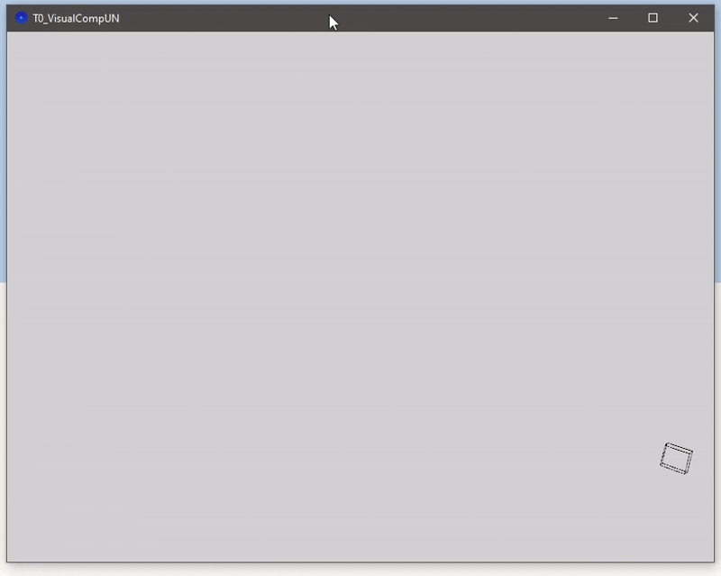

# Taller 0 - Transformaciones Básicas
19-09-2025

## Objetivo
Introducción a **entornos de programación visual** y a las distintas **transformaciones fundamentales** (Traslación, Rotación, y Escalado) aplicadas a objetos geométricos.

## Conceptos Aprendidos
- Entornos de **Programación Visual** (Python (Jupyter), Unity, Threejs, Processing)
- **Transformaciones Geométricas** Fundamentales (Traslación, Rotación, y Escalado)
- Sistemas de referencia **Globales** y **Locales**
- Exportación de resultados en **GIFs**

## Entornos

- Python (`Matplotlib`, `Numpy`)
- Jupyter
- Unity (`LTS` ver.)
- Threejs (`React`, `React-Three-Fiber`, `React-Three-Drei`)
- Processing

## Estructura
```
2025-09-17_Taller_0_Transformaciones/
├── processing/
    ├── src/                    #Proyecto. Código fuente (.pde)
    ├── res/                    #Gif generado
    ├── README.md               #Explicación completa
├── python/                 
    ├── src/                    #Proyecto. Código fuente (Jupyter Notebook)
    ├── res/                    #Gifs generados
    ├── README.md               #Explicación completa
├── threejs/   
    ├── t0visualcomp/           #Proyecto. Código fuente (src/App.jsx)
    ├── res/                    #Gif generado
    ├── README.md               #Explicación completa
├── unity/     
    ├── T0VisualCompUN/         #Proyecto. Código fuente (Assets/Scripts/)
    ├── res/                    #Gif generado
    ├── README.md               #Explicación completa
├── .gitignore
├── README.md               
```
**NOTA:** Cada subdirectorio correspondiente a cada uno de los entornos contiene un `README.md` explicando por **completo** la implementación.
## Implementación
En cada uno de los entornos considerados se realizó una búsqueda de la documentación de cada librería y herramienta utilizada.

Dado que la estructura de las transformaciones es igual en todos los casos, el factor fundamental es el entendimiento general de las transformaciones, es decir, La **razón** de dicha estructura. En conjunto con la previa búsqueda de documentación, el ejercicio se reduce a uno de implementación dependiendo el entorno considerado.

## Etapas Realizadas

1. Documentación por entorno considerado
2. Implementación y visualización inicial 
3. Experimentación con parámetros y funcionalidades
4. Implementación final
5. Visualización de la Animación
6. Generación de Resultados (GIFs de la Animación)
7. Documentación

## Información relevante por entorno

## Processing
### Preliminares
- Creación de un Cubo (objeto `Box`) en la escena principal.
- Traslación del punto de origen del `sistema de referencia global` de la escena
- Uso de `pushMatrix` y `popMatrix` para cambiar entre sistema de referencia `global` (World Space) y `local` (Cubo) ahciendo uso del `Stack`.
- `Detección de Colisiones` en el eje $x$
- Aplicación de transformaciones (Traslación, Rotación y Escalado) haciendo uso de `translate`, `rotateX`, `rotateY`, `rotateZ` y `scale`, con trayectoria `sinusoidal`, escalado suave, y rotación sobre ejes del cubo.
- Generación Animación.

### Código Relevante

```java
void draw() {
  
  background(211);
  
  //World Space Coordinates. Origin (0, 0) at middle of the scene.
  translate(width / 2, height / 2);
  
  //Angle in radians from ms
  angle = 0.1 * radians(millis());
  
  //X axis border collision detection
  if (x >= width / 2 - sz|| x <= - width / 2 + sz) {
    xdir *= -1;
  }
  
  //New X and Y positions
  x +=  xs * xdir;
  y += (WAmp * sin(Freq * angle));
  
  //Scale factor min factor 0.5, max factor 1.5
  scalef = 1 + 0.5 * cos((Freq / 6) * radians(millis()));
  
  //Begin of tranformations. TRS*v scheme
  pushMatrix();
  //Cube's Wireframe
  noFill();
  
  //Translation
  translate(x, y, z);
  
  //Rotations around cube's axis
  rotateX(angle);
  rotateY(-angle);
  rotateZ(angle);
  
  //Smooth Scaling
  scale(scalef);
  
  //Drawing
  box(sz);
  
  popMatrix();
  
}
```
### Resultados Visuales



## Python
### Preliminares
- Descripción de un `polígono` en 2D (Triángulo) dado un conjunto de vértices representados en columna y en Coordenadas Homogéneas.
- Implementación Matrices de Transformación en `Coordenadas Homogéneas`.
- Aplicación de transformaciones (Traslación, Rotación y Escalado) al Triángulo
- Generación 4 Animaciones. Traslación, Rotación, Escalado y las 3 en conjunto.

### Código Relevante
**Nota:** Código similar para las rutinas de Traslación, Escalado y transformación general.
```python
def rotate(verts, th):
    #verts to homogeneous c.
    verts = np.hstack([verts, np.ones([verts.shape[0], 1])])
    
    #Rotation matrix in homogeneous coordinates. 
    #Counterclockwise rotation
    rot_mat = np.array([
                        [np.cos(th), -np.sin(th), 0],
                        [np.sin(th), np.cos(th), 0],
                        [0, 0, 1]
                       ])
    
    #Apply transformation (mat dot column_vector)
    rot_verts = rot_mat @ verts.T

    return rot_verts[:2, :]

#ROTATE TRANSFORMATION DEMO

#Plot initialization. <<rot_tngl>> copies vertex data from original triangle <<tngl>>
rot_fig, rot_axis = plt.subplots()
rot_axis.set_xlim(-20, 20)
rot_axis.set_ylim(-20, 20)

rot_anim, = rot_axis.plot([], [], "r-o")
rot_anim.set_data([], [])

rot_tngl = np.copy(tngl)

def rotate_demo(frames):
    rot_verts = rot_tngl
    theta = 9 * frames // 60
    rot_verts = rotate(rot_verts, theta)
    return rot_anim.set_data(rot_verts[0, :], rot_verts[1, :])

FPS = 60
f = 300
rot_demo_ani = AnimeEnv(fig = rot_fig, 
                        func = rotate_demo, 
                        frames = f, 
                        interval = 1000 / FPS
                       )
plt.close()

#Save gif
rot_demo_ani.save("../res/2D_Rotation_Transformation.gif", writer = "pillow", fps = FPS)
```
### Resultados Visuales

#### Traslación


#### Rotación


#### Escalado


### TRS (General)


## Threejs
### Preliminares
- Creación de un Cubo (objeto `mesh`) y plano de referencia en la escena principal `Canvas` de un proyecto en `Vite + React`.
- Aplicación de transformaciones (Traslación, Rotación y Escalado) con trayectoria `sinusoidal`, escalado suave y rotación sobre sus propios ejes.
- Generación de `shadows` por parte del cubo en el plano de referencia.
- Uso de `OrbitControls`
- Generación Animación.

### Código Relevante

```cs
function CubeTRSTransformation() {
  //React hook
  const mesh_obj = useRef();

  //Cube Initial Coordinates
  const InitialPos = [-15, 0, 0];

  useFrame((state, delta) => {
    if (mesh_obj.current) {

      //Sine curve parameters
      const WAmp = 1.5;
      const Freq = 4;
      

      //Cur time
      const t = state.clock.getElapsedTime()

      //Smooth Scale factor (Avoids negative size)
      const SmoothScale = 2 + (WAmp / 5) * Math.sin(t)
      
      //Translation (Sinusoidal trajectory). Movement along X to notice sinusoidal

      mesh_obj.current.position.x = InitialPos[0] + 0.7 * t
      mesh_obj.current.position.y = InitialPos[1] + WAmp * Math.sin(t * Freq)
      mesh_obj.current.position.z = 0

      //Axis rotation
      mesh_obj.current.rotation.x += 0.7 * delta;
      mesh_obj.current.rotation.y += 0.7 * delta;
      mesh_obj.current.rotation.z += 0.7 * delta;

      //Smooth Scale

      mesh_obj.current.scale.set(SmoothScale, SmoothScale, SmoothScale)
    }

  })
```
### Resultados Visuales


## Unity
### Preliminares
- Creación de un Cubo en la escena principal de un proyecto en `Unity`.
- Cámara principal enfocando al cubo.
- Aplicación de transformaciones (Traslación, Rotación y Escalado) al Cubo haciendo uso de `transform.localScale`, `transform.Rotate` y `transform.Translate`.
- Traslaciones pseudoaleatorias respecto al `sistema de referencia local` del cubo.
- Generación Animación.

### Código Relevante

```cs
void Update()
    {
        //SRT Scheme Scheme.

        //Random Translation along X xor Y. 
        if (Time.time >= ElapsedTime + JumpWindow) {
            //Dice sim. Even := X, Odd := Y.
            //Translation is given with respect to the cube's coordinates. It follows is given by the cube's orientation.
            if (Random.Range(0, 6) % 2 == 0)
                transform.Translate(Sign[Random.Range(0, 2)] * TranslationLength, 0, 0);
            else
                transform.Translate(0, Sign[Random.Range(0, 2)] * TranslationLength, 0);

            //Next Jump Window between 2 and 4 secs.
            JumpWindow = Random.Range(2, 5);
            ElapsedTime = Time.time;
        }
        
        
        //Rotation given time in X, Y, Z Axis.
  
        transform.Rotate(RotationSpeed * Time.deltaTime, RotationSpeed * Time.deltaTime, RotationSpeed * Time.deltaTime);
        
 
        //New Scale given time. Min object original Scale: 2.0f (Avoids negative scaling i.e. Undefined behaviour).
        NewScale = InitialScale +  WAmplitude * Mathf.Sin(Time.time);
        transform.localScale = new Vector3(NewScale, NewScale, NewScale);
    }
```
### Resultados Visuales


## Reflexión Final
Los entornos de computación gráfica proveen abstracciones las cuales permiten la manipulación de gráficos por computadora. Esto se realiza por medio de primitivas (triángulos) las cuales permiten construir objetos más complejos y en dimensiones más altas (3D).

La implementación de las `matrices de transformación` permiten entender como se genera la ilusión de movimiento a partir de una secuencia de `frames` generados. Esto, en conjunto con una representación en coordenadas homogéneas, permite realizar la `proyección` de objetos en 3D a 2D.

El apartado más interesante correspondió al aumento en la complejidad que puede llegar una escena cuando varios objetos interactúan entre sí. Esta complejidad sube rápidamente a medida que más objetos entran en escena y debe describirse el comportamiento de cada uno respecto a sí mismo y a la escena. El uso de transformaciones no se limíta ya solo a un objeto en partícular y debe considerarse el lugar de este en el espacio de objetos que lo rodean, así como si es necesario que este aparezca en escena cuando la `cámara` no lo tiene en el foco (`Clipping Space`).

A futuro, la familiaridad con los distintos entornos será fundamental para la creación de las **ideas de mayor complejidad** que se quieren realizar. Esto vendrá con la **práctica e investigación** de los conceptos concernientes a la `computación gráfica`.


