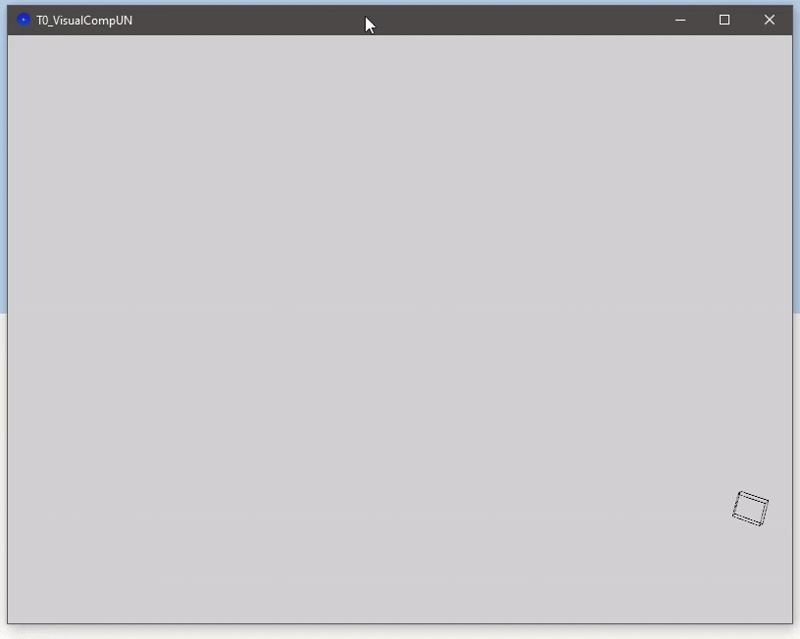

# Transformaciones Básicas
19-09-2025

## Traslación, Rotación y Escalado de Cubo (Box) en Processing



# Explicación del código

```java
float angle;
float scalef;
float xs, ys, xdir, ydir;
float x, y, z;
float WAmp, Freq;

int sz;
```
Tres transformaciones fundamentales (Translate, Rotate, Scale) son aplicadas a un cubo (Objeto *Box*) de tamaño **sz**. Distintos parámetos son utilizados con el fin de modificar su posición respecto a la sistema de referencia **global** y **local**.

```java
void setup() {
  //Aspect, 3D Renderer and FPS
  size(800, 600, P3D);
  frameRate(60);
  
  //Parameters initialization
  angle = 0.0f;
  sz = 30;
  
  scalef = 1.0f;
  
  xs = 3.5;
  xdir = 1.0;
  
  x = 0.0f;
  y = 0.0f;
  z = 0.0f;
  
  WAmp = 5.0;
  Freq = 1.5;
  
}
```

El único elemento en escena es un cubo. A este, se le aplican las transformaciones fundamentales en función del tiempo, en milisegundos, transcurrido desde el inicio de la escena.

El código se divide, principalmente, en 2 secciones fundamentales en donde la lógica de ejecución principalmente reside. Estas corresponden a las funciones:
- setup
- draw

## Setup

```java
void setup() {
  //Aspect, 3D Renderer and FPS
  size(800, 600, P3D);
  frameRate(30);
  
  //Parameters initialization
  angle = 0.0f;
  sz = 30;
  
  scalef = 1.0f;
  
  xs = 3.5;
  xdir = 1.0;
  
  x = 0.0f;
  y = 0.0f;
  z = 0.0f;
  
  WAmp = 5.0;
  Freq = 1.5;
  
}
```
En **setup** se definen las condiciones iniciales y composición de la escena. Esta función es llamada una única vez por parte del entorno de *Processing*.

Inicialmente, se considera una resolución de pantalla la cual definirá el **Aspect Ratio**. En este caso se tiene un Aspect Ratio de 4:3; Por defecto el **Renderer** principal de Processing es *P2D* es cual opera con elementos en 2D. En este caso, el Renderer utilizado es **P3D** el cual permite la manipulación de objetos definidos en 3D.

Consecuentemente se sigue la incialización de las variables que definirán muchas de las trasformaciones que se realizarán al cubo en la escena. Principalmente destacan aquellas que modifican el comportamiento de las funciones periódicas utilizadas en algunas de las transformaciones aplicadas como lo son *WAmp* (Amplitud de onda), *Freq* (Frecuencia de Onda) y *xdir* (Dirección del movimiento a lo largo del eje  $x$).

## Draw

```java
void draw() {
  
  background(211);
  
  //World Space Coordinates. Origin (0, 0) at middle of the scene.
  translate(width / 2, height / 2);
  
  //Angle in radians from ms
  angle = 0.1 * radians(millis());
  
  //X axis border collision detection
  if (x >= width / 2 - sz|| x <= - width / 2 + sz) {
    xdir *= -1;
  }
  
  //New X and Y positions
  x +=  xs * xdir;
  y += (WAmp * sin(Freq * angle));
  
  //Scale factor min factor 0.5, max factor 1.5
  scalef = 1 + 0.5 * cos((Freq / 6) * radians(millis()));
  
  //Begin of tranformations. TRS*v scheme
  pushMatrix();
  //Cube's Wireframe
  noFill();
  
  //Translation
  translate(x, y, z);
  
  //Rotations around cube's axis
  rotateX(angle);
  rotateY(-angle);
  rotateZ(angle);
  
  //Smooth Scaling
  scale(scalef);
  
  //Drawing
  box(sz);
  
  popMatrix();
  
}
```
Antes de aplicar las transformaciones a nivel local, esto es respecto al cubo, se aplica una traslación del sistema de coordenadas de referencia de la escena considerando el *Centro de la Pantalla* como el punto de origen. Esto es dado que usualmente el origen se encuentra en la parte superior izquierda, por lo que al ubicar el cubo en dicha posición, se tendría sufriría del **Clipping** en la escena.

Se define el ángulo en función del tiempo en milisegundos transcurridos y una **Detección de Colisión** a lo largo del eje $x$  dado que allí es por donde el desplazamiento horizontal del cubo se situará. Luego, se actualizan los valores para las nuevas posiciones en $x$ y $y$ del cubo respecto a la escena; A lo largo del eje $x$ el desplazamiento será *lineal*; $y$ desplazamiento descrito por la curva de la función $\sin{\theta}$ en función del tiempo. En conjunto, el cubo describe una trayectoria **sinusoidal**.

El factor de escala es descrito de tal forma que se comporte de manera *suave*, en donde el valor mínimo del mismo es $0.5$ (mitad tamaño original del cubo) y máximo $1.5$ (1.5 veces tamaño original).

El componente principal se realiza cuando se aplican dichos cambios respecto al cubo. 
**pushMatrix** *guarda* (Envía al *Stack*) el **sistema de referencia actual** (en este caso el sistema de referencia de *World Space*) con el fin de no perderlo con las subsiguientes transformaciones. Luego, se realizan las transformaciones del cubo respecto al **sistema de referencia del cubo**, es decir a nivel **local**. Estas constituyen traslación, rotaciones respecto a los 3 ejes y escalado respecto al tamaño (*sz* size) del objeto.

Finalmente al ser aplicadas dichas transformaciones al cubo, se ejecuta **popMatrix** la cual retorna, **restaura**, el último sistema de referencia que había sido envíado al Stack, en este caso el **sistema de referencia del World Space**.

La función **draw** sigue siendo llamada repetidamente por parte de *Processing*. En términos de videojuegos, podría decirse este es el **Game Loop**.
