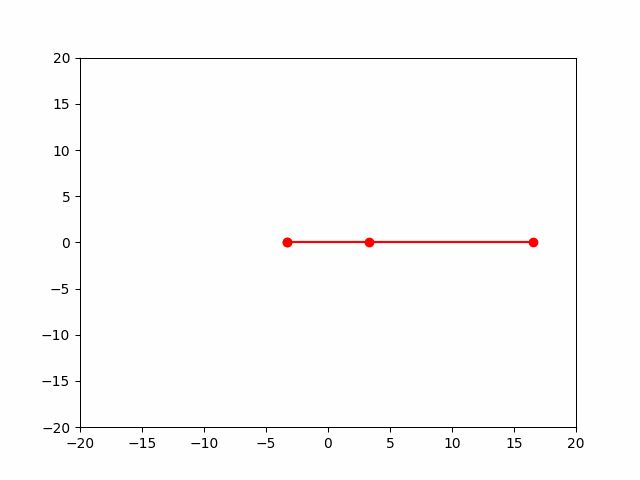
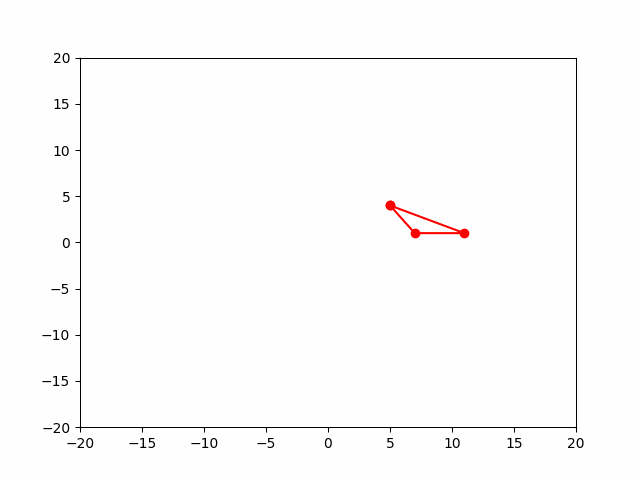

# Transformaciones Básicas
17-09-2025

## Coordenadas Homogéneas
Inicialmente, los vectores que conciernes al plano en $R^2$ son aquellos de la forma $\begin{align}\vec{v} & =\begin{bmatrix} x \\ y\end{bmatrix} \end{align}$ Sin embargo con el objetivo de realizar transformaciones, se requiere de una componente adicional $w$ en el vector, es decir, se requieren vectores en $R^3$ y matrices en $R^3 \times R^3$ (caso 2D).    

Estas transformaciones se realizan por medio de _Matrices de Tranformación_ las cuales otorgan _Transformaciones no Líneales_, alscuales incluyen a las _Tranformaciones Afínes_ y _Transformaciones Projectivas_ ampliamente utilizadas en entornos de computación gráfica.  

Las transformaciones aquí consideradas corresponden a _Escalado_, _Rotación_, y _Traslación_.
## Escalado (Scale)

```python
def scale(verts, sx, sy):
    #verts to homogeneous c.
    verts = np.hstack([verts, np.ones([verts.shape[0], 1])])

    #Scale matrix in homogeneous coordinates.
    sc_mat = np.array([
                        [sx, 0, 0],
                        [0, sy, 0],
                        [0, 0, 1]
                      ])
    
    #Apply transformation (mat dot column_vector)
    sc_verts = sc_mat @ verts.T

    return sc_verts[:2, :]
```
La matríz de escalado transforma las componentes $x, y$ de un conjunto de vértices en coordenadas homogéneas ordenados en columna al aplicar la transformación dada por la matriz.$$\begin{pmatrix}
sx & 0 & 0\\
0 & sy & 0\\
0 & 0 & 1
\end{pmatrix} \begin{bmatrix}
x_1 \\
y_1 \\
1 
\end{bmatrix} = \begin{bmatrix}
sx \cdot x_1 \\
sy \cdot y_1 \\
1 
\end{bmatrix}$$ 
Esto implica que para puntos $[2, 3]$ y escalares $sx = 2$ y $sy = 4$, al aplicar la transformación sus componentes serán [4, 12].

## Rotación (Rotation)

```python
def rotate(verts, th):
    #verts to homogeneous c.
    verts = np.hstack([verts, np.ones([verts.shape[0], 1])])
    
    #Rotation matrix in homogeneous coordinates. 
    #Counterclockwise rotation
    rot_mat = np.array([
                        [np.cos(th), -np.sin(th), 0],
                        [np.sin(th), np.cos(th), 0],
                        [0, 0, 1]
                       ])
    
    #Apply transformation (mat dot column_vector)
    rot_verts = rot_mat @ verts.T

    return rot_verts[:2, :]
```
La matríz de rotación transforma las componentes $x, y$ de un vector realizando una rotación de los puntos alrededor del _punto de orígen_ a un ángulo $\theta$. 
 
$$\begin{pmatrix}
cos(\theta) & -sin(\theta) & 0\\
sin(\theta) & cos(\theta) & 0\\
0 & 0 & 1
\end{pmatrix} \begin{bmatrix}
x_1 \\
y_1 \\
1 
\end{bmatrix} = \begin{bmatrix}
x \cdot cos(\theta) - sy \cdot sin(\theta) \\
x \cdot sin(\theta) + y \cdot cos(\theta) \\
1 
\end{bmatrix}$$

Si se representara un vector en _coordenadas polares_, notese la matríz de rotación corresponde a la suma de los ángulos $\theta + \gamma$ donde $\gamma$ es el ángulo al cual se encontraba el vector respecto a la horizontal, eje $x$, y $\theta$ es el ángulo de rotación de la transformación. 

$x = r\cdot cos(\gamma)$,  $y = r \cdot sin(\gamma)$:

$$\begin{pmatrix}
cos(\theta) & -sin(\theta) & 0\\
sin(\theta) & cos(\theta) & 0\\
0 & 0 & 1
\end{pmatrix} \begin{bmatrix}
x_1 \\
y_1 \\
1 
\end{bmatrix} = \begin{bmatrix}
r\cdot cos(\gamma) \cdot cos(\theta) - r \cdot sin(\gamma) \cdot sin(\theta) \\
r \cdot cos(\gamma) \cdot sin(\theta) + r \cdot sin(\gamma) \cdot cos(\theta) \\
1 
\end{bmatrix}$$
$$
\begin{bmatrix}
r \cdot cos(\gamma + \theta) \\
r \cdot sin(\gamma + \theta) \\
1 
\end{bmatrix}
$$

## Traslación (Translate)

```python
def translate(verts, tx, ty):
    #verts to homogeneous c.
    verts = np.hstack([verts, np.ones([verts.shape[0], 1])])
    #Translation matrix in homogeneous coordinates.
    tr_mat = np.array([
                        [1, 0, tx],
                        [0, 1, ty],
                        [0, 0, 1]
                      ])
    #Apply transformation (mat dot column_vector)
    tr_verts = tr_mat @ verts.T
    
    return tr_verts[:2, :]
```
La matriz de traslación transforma las componentes de un vector aplciando una _traslación_ (desplazamiento) de los mismos, es decir, un offset respecto a la posición original.
$$\begin{pmatrix}
1 & 0 & tx\\
0 & 1 & ty\\
0 & 0 & 1
\end{pmatrix} \begin{bmatrix}
x_1 \\
y_1 \\
1 
\end{bmatrix} = \begin{bmatrix}
x_1 + tx \\
y_1  + ty\\
1 
\end{bmatrix}
$$

En donde la nueva posición est+a dada por $x^{'} = x + tx$, $y^{'} = y + ty$ y $w^{'} = w = 1$

# Transformación general TRS

Finalmente, una aplicación de las tres transformaciones se realiza con el fin de modificar la posición de un vector. El orden estándar corresponde a _Scale_, _Rotation_, y Translation.

Dado que en esta representación el vector está en forma de columna, se sigue:

$$\begin{pmatrix}
1 & 0 & tx\\
0 & 1 & ty\\
0 & 0 & 1
\end{pmatrix}
\begin{pmatrix}
cos(\theta) & -sin(\theta) & 0\\
sin(\theta) & cos(\theta) & 0\\
0 & 0 & 1
\end{pmatrix}
\begin{pmatrix}
sx & 0 & 0\\
0 & sy & 0\\
0 & 0 & 1
\end{pmatrix}
\begin{bmatrix}
x_1 \\
y_1 \\
1 
\end{bmatrix}
$$
```python
def general_demo(frames):
    gen_verts = gen_tngl
    
    #Scale
    sx = 1.0 + 0.6 * np.cos(2* frames // 60)
    sy = 1.0 + 0.8 * np.sin(2* frames // 60)
    
    #Rotate
    theta = 6 * frames // 60

    #Translate
    tx = 2.2 * np.cos(8 * frames // 60)
    ty = 2.2 * np.sin(8* frames // 60)
    
    #TRS
    gen_verts = translate(rotate(scale(gen_verts, sx, sy).T, theta).T, tx, ty)

    #<TRS, v> transformation
    return gen_anim.set_data(gen_verts[0, :], gen_verts[1, :])
```
En donde las tres transformaciones se aplican a un vector.

# Explicación del código
El código presentado puede dividirse en 3 apartados: 
- Polígono (Vértices Triángulo)
- Rutinas de Transformación
- Rutinas de Animación

## Polígono
```python
#DEMO POLYGON: BASE TRIANGLE

b_verts = np.array([
                    [-1, 4],
                    [5, 1],
                    [1, 1]
                 ])

#Add first point at end to complete the triangle with lines
#Counterclockwise vertex positioning is assumed
tngl = np.vstack([b_verts, b_verts[0:1]]) 
```
*b_verts* son los vértices del polígono original. Dado que debe conectarse el polígono por medio de *líneas*, *tngl* añade el vértice inicial de *b_verts* al conjunto de vértices con el fin de que la función que conecta los puntos pueda tener el punto final de conexión.

Se sigue que para un polígono de $n$ vértices, se operan $n + 1$ vértices para completar el mismo.
## Rutinas de Transformación
Son aquellas que implementan las distintas transformaciones presentadas. Se tienen 3 de este tipo. La implemetnación de las mismas se mostró en secciones anteriores.
- Scale
- Rotate
- Translate

Cada una de ellas recibe como parámetro en común un conjunto de vértices correspondientes a un polígono, en este caso un triángulo, y los parámetros restantes corresponden a aquellos concernientes a la transformación. Así:
```python
#sx: Escalar de transformación en x (factor de escalado)
#sy: Escalar de transformación en y (factor de escalado)
def scale(verts, sx, sy) 

#th: Ángulo Theta
def rotate(verts, th)

#tx Factor de traslación en x
#ty Factor de traslación en y
def translate(verts, tx, ty)
```

## Rutinas de Animación
Estas rutinas se encargan del llamado a las funciones de transformación, guardado de los puntos transformados y generación de _frames_ los cuales son utilizados para generar la animación con los distintos valores de los puntos al aplicarse una transformación.

El *template* de estas rutinas es similar en las 4 implementadas. Se presenta la totalidad de la rutina **rotate_demo**. Las rutinas **scale_demo**, **translate_demo** y **general_demo** siguen la misma estructura en la cual solo cambian los parámetros de las transformaciones correspondientes.

```python
#ROTATE TRANSFORMATION DEMO

#Plot initialization. <<rot_tngl>> copies vertex data from original triangle <<tngl>>
rot_fig, rot_axis = plt.subplots()
rot_axis.set_xlim(-20, 20)
rot_axis.set_ylim(-20, 20)

rot_anim, = rot_axis.plot([], [], "r-o")
rot_anim.set_data([], [])

rot_tngl = np.copy(tngl)

def rotate_demo(frames):
    rot_verts = rot_tngl
    theta = 9 * frames // 60
    rot_verts = rotate(rot_verts, theta)
    return rot_anim.set_data(rot_verts[0, :], rot_verts[1, :])

FPS = 60
f = 300
rot_demo_ani = AnimeEnv(fig = rot_fig, 
                        func = rotate_demo, 
                        frames = f, 
                        interval = 1000 / FPS
                       )
plt.close()

#Save gif
rot_demo_ani.save("../res/2D_Rotation_Transformation.gif", writer = "pillow", fps = FPS)
```
La sección inicial hace uso de *matplotlib* con el fin de tener un entorno en el cual puedan graficarse los puntos que describen el polígono. Inicialmente, todas las componentes ésta gráfica no tienen valor alguno por lo que se inicializan vacías. Luego, una copía de los vértices originales del polígono es realizada con el fin de aplicar las transformaciones a los mismos sin alterar el original.

```python
#ROTATE TRANSFORMATION DEMO

#Plot initialization. <<rot_tngl>> copies vertex data from original triangle <<tngl>>
rot_fig, rot_axis = plt.subplots()
rot_axis.set_xlim(-20, 20)
rot_axis.set_ylim(-20, 20)

rot_anim, = rot_axis.plot([], [], "r-o")
rot_anim.set_data([], [])

rot_tngl = np.copy(tngl)
```

La rutina toma esta copia *local* de los vértices del polígono y aplica la correspondiente transformación (en este caso rotación), sobrescribiendo los valores originales del mismos y pasando las componentes $x$ e $y$ de los mismos a la gráfica. Cada *snapshot* de los vértices transformados se captura en un *frame*, en donde al final la secuencia de un conjunto de estos conformará el *gif* producido

```python

def rotate_demo(frames):
    rot_verts = rot_tngl
    theta = 9 * frames // 60
    rot_verts = rotate(rot_verts, theta)
    return rot_anim.set_data(rot_verts[0, :], rot_verts[1, :])

```

Finalmente, la animación corresponde a un objeto, en este caso *AnimeEnv* el cual construye la animación al llamar repetidamente a la función (rutina) de transformación, generando la snapshot anteriormente mencionada y juntando los frames de las mismas para producir el gif.

El parámetro *fig* corresponde al objeto en donde se graficarán los puntos transformados, *func* es la función (rutina) de transformación que será llamada repetidamente (*callback*)¨, *frames* la cantidad de frames deseados e *interval* la duración entre cada frame (*snapshot*) de la animación.

```python
FPS = 60
f = 300
rot_demo_ani = AnimeEnv(fig = rot_fig, 
                        func = rotate_demo, 
                        frames = f, 
                        interval = 1000 / FPS
                       )
plt.close()

#Save gif
rot_demo_ani.save("../res/2D_Rotation_Transformation.gif", writer = "pillow", fps = FPS)
```

#### Aclaración: 
La clase utilizada para animar, parte de **matplotlib**, ofrece la posibilidad de generar el correspondiente *gif* de la animación por lo que se hace innecesario el utilizar una librería adicional. Esto se evidencia al final del código presentado por parte del método **save** del objeto *AnimeEnv*.


