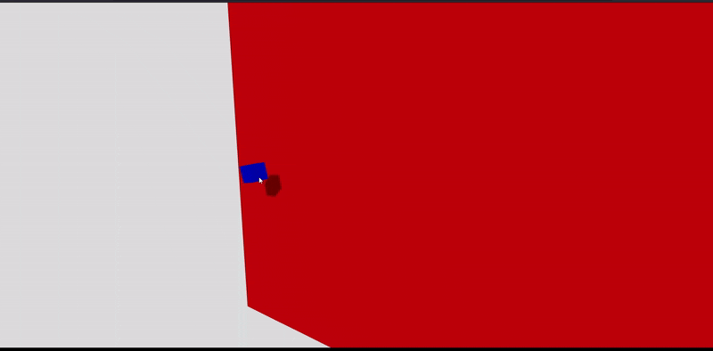

# Transformaciones Básicas
18-09-2025

## Traslación, Rotación y Escalado de Cubo (Box) en Three.js


Se comprenden las tres transformaciones fundamentales (Translate, Rotate, Scale) son aplicadas a un cubo (Elemento *box*) en la escena de *React Three Fiber*.

# Explicación del código

La escena está compuesta de 2 elementos, un **plano** el cual es utilizado como referencia y un **cubo** al cual se le aplican las distintas transformaciones.

Plano de referencia (*ReferenceGround*)
```javascript
function ReferenceGround() {

  //Behind Cube for reference.
  return (
    <mesh position = {[0, 0, -4]}
      receiveShadow>
      <planeGeometry args = {[40, 40]}/>
      <meshStandardMaterial color = "red"/>
    </mesh>
  )
}

```

Este plano se define como una cuadrado de 40 por 40 unidades de longitud. Se encuentra posicionado *atrás* del cubo y de la cámara principal, es decir, es el objeto más lejano respecto al espectador. Una de las características es que sobre él, se aplica el atributo **receiveShado** el cual permite que sobre el puedan proyectarse sombras de objetos enfrente, respecto a la normal del plano, al proyectarse una luz en la escena. En este caso se trata de una luiz direccional.

```javascript
function CubeTRSTransformation() {
  //React hook
  const mesh_obj = useRef();

  //Cube Initial Coordinates
  const InitialPos = [-15, 0, 0];

  useFrame((state, delta) => {
    if (mesh_obj.current) {

      //Sine curve parameters
      const WAmp = 1.5;
      const Freq = 4;
      

      //Cur time
      const t = state.clock.getElapsedTime()

      //Smooth Scale factor (Avoids negative size)
      const SmoothScale = 2 + (WAmp / 5) * Math.sin(t)
      
      //Translation (Sinusoidal trajectory). Movement along X to notice sinusoidal

      mesh_obj.current.position.x = InitialPos[0] + 0.7 * t
      mesh_obj.current.position.y = InitialPos[1] + WAmp * Math.sin(t * Freq)
      mesh_obj.current.position.z = 0

      //Axis rotation
      mesh_obj.current.rotation.x += 0.7 * delta;
      mesh_obj.current.rotation.y += 0.7 * delta;
      mesh_obj.current.rotation.z += 0.7 * delta;

      //Smooth Scale

      mesh_obj.current.scale.set(SmoothScale, SmoothScale, SmoothScale)
    }

  })

  //Cube geometry
  return (
    <mesh ref={mesh_obj}
      castShadow>
      <boxGeometry args={[1, 1, 1]} />
      <meshStandardMaterial color="blue" />
    </mesh>
  )

}
```
El objeto principal de la escena es un cubo (objeto tipo *Box*). Sobre él se aplican 3 transformaciones fundamentales (Escalado, Rotación, y Traslación).

La posición inicial del objeto tiene un **offset** de -15 en el eje  $x$  a la izquierda del espectador. Esto es dado que para evidenciar el movimiento, en específico trayectoria, **sinusoidal** del objeto respecto al eje $y$, requiere un cambio en uno de los ejes de manera proporcional al tiempo. En este caso el eje $x$ es el eje en el cual el desplazamiento es *lineal* y por lo tanto sirve como referencia para evidenciar la trayectoria.

La primera transformación de traslación es, como se enunció, una trayectoria sinusoidal. para esto, la posición del cubo en el eje  $y$ varía en función del tiempo de la escena $t$ con la función $\sin{\theta}$ donde $\theta$ es igual al producto del tiempo y la **frecuencia**. Luego, esta curva es *escalada* dada una **amplitud**.

La segunda transformación corresponde a la rotación del cubo respecto a todos sus ejes. Para esto, se tiene en cuenta un tiempo **delta** el cual es escalado a un factor de $0.7$ en cada eje cada *frame* transcurrido de la escena.

Finalmente la escala *suave* del objeto se realiza respecto a sus 3 dimensiones en functión del tiempo y la función $\sin{\theta}$.

Una particularidad es que, a diferencia del plano de referencia, este objeto tiene como atributo **castShadow**, lo cual será utilizado para ver el movimiento del mismo en la escena respecto al plano.

```javascript
export default function App() {
  return (
    <Canvas 
    camera = {{position: [0, 3, 8]}}
    shadows>

      <OrbitControls enableRotate 
        enablePan 
        enableZoom />

      //Overall light. Smooth scene.
      <ambientLight intensity = {0.5}/>

      <directionalLight position={[5, 5, 10]} 
        intensity={1} 
        //Enables shadows casting by directional light
        castShadow
        //Increase frustum of directional light camera
        shadow-camera-top = {50}
        shadow-camera-bottom = {-50}
        shadow-camera-left = {-50}
        shadow-camera-right = {50}
        //Shadow quality (Increases frustum -> blurry shadows (lq))
        shadow-mapSize-width = {1024}
        shadow-mapSize-height = {1024}/>

      //Geometry rendering
      <ReferenceGround />
      <CubeTRSTransformation />
  
    </Canvas>
  );
}
```
La escena es renderizada por medio del objeto **Canvas**. En este se comprenden todos los elementos de la escena, los cuales constituyen tanto elementos geométricos (cubo, plano), como elementos de tipo cámara y luces de tipo ambiental y direccional.

Se definen también los elementos de control de la escena los cuales permiten *acercar*, *desplazar* y *rotar* la cámara principal por parte del espectador.

Un atributo fundamental que se define es **shadows**. Este permite que en la escena este comportamiento sea habilitado. Así, tanto los objetos que reciben sombras como aquellos que las generan, dado en ambos casos la existencia de una luz, puedan generar dicho comportamiento.

La mayor parte de esta sección corresponde a al luz direccional utilizada para acentuar el movimiento del cubo con respecto al plano y, en general, a la escena. Los parámetros comprendidos corresponden a las dimensiones del **frustum** de la cámara de luz direccional. Cuando este tiene pequeñas dimensiones, los *rayos* de luz generados se concentran en un área muy pequeña centrada en el origen. Así, cuando se aumenta el tamaño del frustum, se perciben las sombras, si habilitadas, de varios objetos a los cuales dichos rayor impactan. Finalmente los parámetros **shadowMap** permiten tener una mejor calidad en las sombras.

El último paso es el renderizado de la geometría principal de la escena, en este caso, el plano y el cubo.