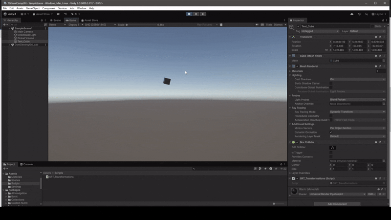

# Transformaciones Básicas
18-09-2025

## Traslación, Rotación y Escalado (TRS) en Unity


En una escena en **Unity**, tres transformaciones fundamentales (Translate, Rotate, Scale) son aplicadas a un cubo (*Test_Cube*) en el entorno.

# Explicación del código

```cs
public class SRT_Transformations : MonoBehaviour
```
Las transformaciones aplicadas al cubo corresponden a un Script en **C#** el cual abstrae las mismas en una clase base denominada *MonoBehaviour*. Esta clase sirve como base, clase *parent*, para aquellas clases utilizadas con el fin de modificar el comportamiento de los objetos de tipo **GameObject**.

```cs
    float InitialScale = 2.5f;
    float WAmplitude = 1.5f;
    float NewScale = 0.0f;

    float RotationSpeed = 25.0f;

    float TranslationLength = 1.6f;
    float JumpWindow = 3.0f;
    int[] Sign = { 1, -1 };

    float ElapsedTime = 0.0f;
```
Las variables presentadas corresponden a atributos dentro de la clase con el fin de dictar el comportamiento deseado en cada una de las transformaciones.

En el primer bloque de 3 atributos, se describen una escala inicial para el cubo, luego la amplitud máxima de la función $\sin{\theta}$ a utilizar y una varuabe que será actualizada en cada iteración, actualización o **frame**, de la escena.

El segundo bloque comprende la velocidad ángular de rotación en cada uno de los ejes del cubo  $[X, Y, Z]$.

Finalmente el último bloque constituye 3 atributos que controlan la traslación pseudoaleatorio en los eje $X$  o  $Y$ exclusivo. El primero es la distancia de traslación a lo largo del eje X o Y desde la posición del cubo y respecto a la orientación del cubo, la segunda el *Tiempo de Salto* (Intervalo) entre los cuales se producen las traslaciones. Inicialmente este es de 3 segundos, sin embargo se tendrá un intervalo entre 2 y 4 segundos para la traslación pseudoaleatoria. Finalmente un arreglo de 2 valores correspondientes a la dirección de la traslación.

```cs
    void Update()
    {
        //SRT Scheme Scheme.

        //Random Translation along X xor Y. 
        if (Time.time >= ElapsedTime + JumpWindow) {
            //Dice sim. Even := X, Odd := Y.
            //Translation is given with respect to the cube's coordinates. It follows is given by the cube's orientation.
            if (Random.Range(0, 6) % 2 == 0)
                transform.Translate(Sign[Random.Range(0, 2)] * TranslationLength, 0, 0);
            else
                transform.Translate(0, Sign[Random.Range(0, 2)] * TranslationLength, 0);

            //Next Jump Window between 2 and 4 secs.
            JumpWindow = Random.Range(2, 5);
            ElapsedTime = Time.time;
        }
        
        
        //Rotation given time in X, Y, Z Axis.
  
        transform.Rotate(RotationSpeed * Time.deltaTime, RotationSpeed * Time.deltaTime, RotationSpeed * Time.deltaTime);
        
 
        //New Scale given time. Min object original Scale: 2.0f (Avoids negative scaling i.e. Undefined behaviour).
        NewScale = InitialScale +  WAmplitude * Mathf.Sin(Time.time);
        transform.localScale = new Vector3(NewScale, NewScale, NewScale);
    }
```

La lógica principal del script ocurre en la rutina (función) **update**.  
Primero, para realizar la traslación, se verifíca el timepo en segundos *Time.time* y se compara con *JumpWindow*, la cual se actualiza respecto a al última llamada a *Time.time* y un valor pseudoaleatorio entre 2 y 4 segundos. *ElapsedTime* es el tiempo en segundos desde el inicio del Script hasta el momento dado.

Aclaración: La traslación se da **respecto al los ejes del cubo** y no de la escena, World Space.

Dado el intervalo, si un número entre  $[0, 1, 2, 3, 4, 5]$  es par, la traslación se hace en el eje  $X$  y la dirección de la misma está dada por un criterio similar de pseudoaleatoreidad.

Caso contraro, impar, la traslación es realizada en el eje  $Y$.

La rotación se realiza dada una rapidez de rotación inicial, *RotationSpeed*, y un factor, Time.deltaTime, el cual incremetna gradualmente la misma. Así, se tiene una rotación en los 3 ejes que incrementa en velocidad en cada iteración.

Finalmente, el escalado se realiza dada una escala inicial mínima, con el fin de evitar un **tamaño negativo** en conjunto con un escalado oscilante, dada la función  $\sin{\theta}$, com $\theta$ u n ángulo en función del tiempo transcurrido y una amplitud *WAmplitude*.