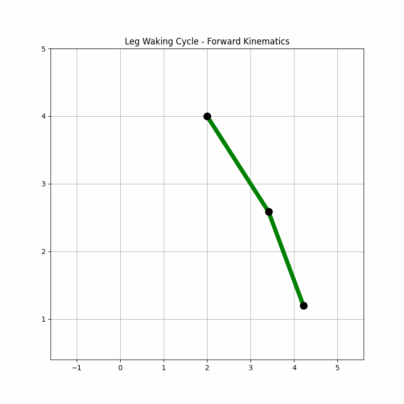
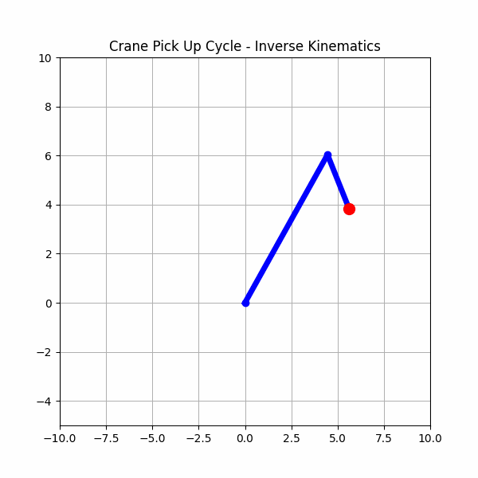
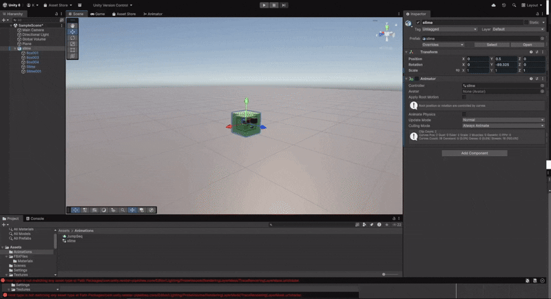
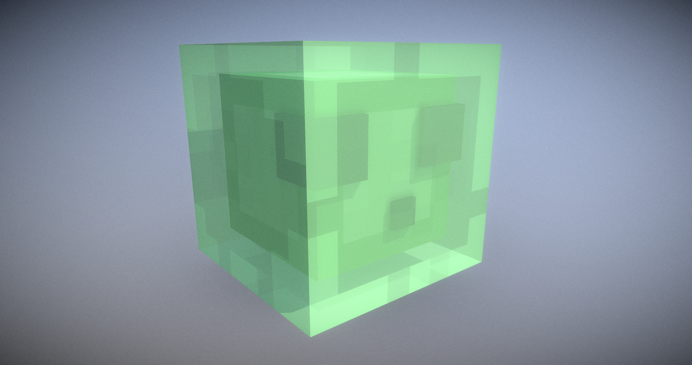

# Práctica 3 - Forward Kinematics, Inverse Kinematics, Animation
2025-10-13

## Entornos
- Python (`Jupyter Notebook`, `Numpy`, `Matplotlib`)
- Unity (`Game Engine` Last 6000.2,7f2 ver.)

## Estructura

```
2025-10-13_Practica_3_FK_IK_Animation/
├── assets/                 #Generated GIFs, Animations, Content from implementations.
├── python/                
    ├── kinematics/         #Python src code. Forward and Inverse Kinematics.
    ├── res/                #Generated GIFs for Leg and Crane Animation.
├── unity/
    ├── P3AniDemo/          #Folder with Unity Scene objects and structure
        ├── Assets/
           ├── FBXFiles/    #3D Objects (Slime).
           ├── Animations/  #.anim files. 
├── README.md               
```

## Forward Kinematics
```Python
def forward_kinematics(L1, L2, theta1, theta2, x0 = 0.0, y0 = 0.0):
    #Initial offset. From base (x0, y0) to (x1, y1)
    x1 = L1 * np.cos(theta1)
    y1 = L1 * np.sin(theta1)

    #Second Offset. From (x1, y1) to (x2, y2) Final.
    #theta1 + theta2 full angle rot at x2, y2 tith respect to base horizontal. CCW.
    x2 = x1 + L2 * np.cos(theta1 + theta2)
    y2 = y1 + L2 * np.sin(theta1 + theta2)

    #Base point, First Offset, Second offset. Real res: x0 + x2
    xf = np.array([x0, x0 + x1, x0 + x2])
    yf = np.array([y0, y0 + y1, y0 + y2])
    
    return (xf, yf)
```

### Implementación
Las transformaciones utilizadas corresponden a aquellas de la forma $T_i := TR$, en donde la matriz $R$ es una matrix de rotación y $T$ una traslación. En el caso 2D, esto es cuando el ejer de rotación es $Z$, el encontrar el punto final dado un punto inicial y una serie de ángulos $\theta_i$ para cada articulación $i$ en donde cada enlace, extremidad, tiene longitud $L_i$ se reduce a aplicar una serie de transformaciones, concatenación, de cuerpo rígido.

Así, para un punto inicial $\left(x_0, y_0\right)$ en un sistema que una "pierna" se tiene que: $\theta_1$ es el ángulo entre la cadera y el muslo, el cual tiene longitud $L_1$;  $\theta_2$ es el ángulo entre el muslo y la tibia, siendo este respecto a la recta trazada en dirección del muslo. $L_2$ longitud de la tibia.

Se sigue que el punto $\left(x_f, y_f\right)$, corresponde al punto ubicado en el extremo de la tibia, es decir, en donde se encuentra, normalmente, el pie. Luego, este puede ser descrito en función del punto inicial y transformaciones del mismo aplicadas hasta llegar a su misma posición.

La primera transformación involucrada es $x_1 = L_1 \cdot \cos{\theta_1}$ y $y_1 = L_1 \cdot \sin{\theta_1}$. Este punto corresponde al punto en la articulación entre el muslo y la tibia. Es decir, el punto extremo de a una distancia $L_1$ y a un ángulo, CCW, $\theta_1$ respecto al origen (cadera). Se toma como referencia el punto de conexión entre la cadera y el muslo como el orígen.

La segunda transformación indica el punto $\left(x_2, y_2\right)$, el punto obejtivo de la transformación general. Nótese este se encuentra dado por $x_2 = x_1 + L_2 \cdot \cos{\left(\theta_1 + \theta_2\right)}$  $y_2 = y_1 + L_2 \cdot \sin{\left(\theta_1 + \theta_2\right)}$. Esto es dado que el segmento, de longitud $L_2$ tiene como orígen la articulación, es decir  $\left(x_1, y_1\right)$. Luego, el ángulo $\theta_2$ se genera respecto al muslo, sin embargo, en el espacio global en el plano, este ángulo hace parte de la suma del ángulo total generado respecto al origen global. Este es $\theta_1 + \theta_2$ es la rotación total del punto $\left(x_2, y_2\right)$ respecto al origen global.

Dadas estas observaciones se sigue $$\left(x_2, y_2\right) := \left(L_1 \cdot \cos{\theta_1} + L_2 \cdot \cos{\left(\theta_1 + \theta_2\right)}, L_1 \cdot \sin{\theta_1} + L_2 \cdot \sin{\left(\theta_1 + \theta_2\right)} \right)$$
$$\left(x_2, y_2\right) := \left(x_1 + L_2 \cdot \cos{\left(\theta_1 + \theta_2\right)}, y_1 + L_2 \cdot \sin{\left(\theta_1 + \theta_2\right)} \right)$$
$$\left(x_2, y_2\right) = \left(x_f, y_f\right)$$

El punto final, objetivo, dadas unas condiciones iniciales en el sistema.

FIN.


## Inverse Kinematics

```Python
def inverse_kinematics(L1, L2, x_f, y_f):
    r = np.sqrt(x_f ** 2 + y_f ** 2)

    #Edge Case. Impossible. if r > L1 + L2 or r < abs(L1 - L2)
    #You fucked up.
    if r < 0 or r > L1 + L2 or r < abs(L2 - L1):
        return (np.nan, np.nan)
        
    #THETA2
    #L1, L2, r triangle. CW Angle i.e. neg angle
    cos_gamma = (L1 ** 2 + L2 ** 2 - r ** 2) / (2 * L1 * L2)
    cos_gamma_clip = np.clip(cos_gamma, -1.0, 1.0)
    gamma = np.arccos(cos_gamma_clip)
    theta2 = -(np.pi - gamma)

    #THETA 1 = alpha - theta2
    alpha = np.atan2(y_f, x_f)
    cos_beta = (L1 ** 2 + r ** 2 - L2 ** 2) / (2 * L1 * r)
    cos_beta_clip = np.clip(cos_beta, -1.0, 1.0)
    beta = np.arccos(cos_beta_clip)
    theta1 = alpha - beta

    return (theta1, theta2)
```

### Implementación

El problema de Cinemática Inversa tiene como condiciones iniciales el punto final en el sistema y como objetivo se quieren hallar la serie de parámetros que permiten llegar al mismo.

En este caso, el sistema consiste de una grúa, Crane, con dos enlaces, extremidades, de longited $L_1$ y $L_2$, en donde $L_1$ es la longitud del brazo desde el origen hasta la articulación y $L_2$ la longitud desde la articulación hasta el gancho, hook, de la grúa. Los ángulos se describen de manera similar que en el problema anterior; $\theta_1$ describe la elevación del brazo principal respecto a la horizontal en donde se apoya la grúa, $theta_2$ describe el ángulo entre el gancho y el brazo respecto a la recta trazada por el brazo.

Partiendo del punto final $\left(x_f, y_f\right)$, por las ecuaciones presentadas anteriormente se tiene que este está descrito por
$$\left(x_f, y_f\right) := \left(L_1 \cdot \cos{\theta_1} + L_2 \cdot \cos{\left(\theta_1 + \theta_2\right)}, L_1 \cdot \sin{\theta_1} + L_2 \cdot \sin{\left(\theta_1 + \theta_2\right)} \right)$$

Nótese que el punto $\left(x_f, y_f\right)$ está a una distancia $r$ del origen, punto de apoyo de la grúa. Se sigue $r^{2} = x_f^{2} + y_f^{2}$. Teniendose esta hipotenusa, considerese el triángulo, no necesariamente rectángulo, conformado por $L_1$ (Brazo), $L_2$ (Gancho) y $r$ (Distancia desde el origen del sistema).

Nótese que $r$ está descrito por 
$$r^{2} = L_1^{2} + L_2^{2} - 2L_1L_2\cos{\gamma}$$
Donde $\gamma$ es el ángulo total entre $L_1$ y $L_2$. La identidad se sigue de la Ley de los Cosenos. Sin embargo, se tiene que $\pi - \theta_2 = \gamma$, se sigue $\pi - \gamma = \theta_2$. Esto es dado $\theta_2$ se indica respecto al brazo de la grúa. Se sigue por la identidad $\cos{\left(\pi - \theta\right)} = -\cos{\theta}$
$$r^{2} = L_1^{2} + L_2^{2} - 2L_1L_2\cos{\left(\pi - \theta_2\right)}$$
$$r^{2} = L_1^{2} + L_2^{2} + 2L_1L_2\cos{\theta_2}$$

Así, para obtener $\theta_2$ se considera despejar el mismo de la ecuación, es decir
$$\theta_2 = \pm \arccos{\left(\frac{r^{2} - L_1^{2} - L_2^{2}}{2L_1L_2}\right)}$$
Luego, dado que el ángulo entre el gancho y el brazo se tiene en dirección de las manecillas del reloj, se sigue el signo es negativo. Finalmente. 

$$\theta_2 = - \arccos{\left(\frac{r^{2} - L_1^{2} - L_2^{2}}{2L_1L_2}\right)}$$

El razonamiento para $\theta_1$ es similar. Se consideran dos ángulos en el sistema cuya resta corresponde a $\theta_1$.

El primer ángulo es aquel correspondiente al triángulo rectángulo $x_f$, $y_f$, y $r$. Este ángulo, denótese $\alpha$, está dado por el arcotangente de 2 argumentos.

$$\alpha = \arctan2{\left(\frac{y_f}{x_f}\right)}$$

El segundo ángulo, denótese $\beta$ está dado por el triángulo $L_1$, $L_2$, y $r$. En este, el cual está generado por $r$ y $L_1$ en el origen, por la ley de los cosenos se tiene que 
$$L^{2} = r^{2} + L_1^{2} - 2L_1r\cos{\left(\beta\right)}$$
$$\beta = \arccos{\left(\frac{r^{2} + L_1^{2} - L_2^{2}}{2L_1r1}\right)}$$

Con $\theta$ positivo dado que está en dirección en contra de las manecillas del reloj.

Finalmente, $\theta_1$ está dado por $\alpha - \beta$. Se sigue
$$\theta_1 = \arctan2{\left(\frac{y_f}{x_f}\right)} - \arccos{\left(\frac{r^{2} + L_1^{2} - L_2^{2}}{2L_1r1}\right)}$$

Conociendo los ángulos necesarios para dicho punto, se suma el hecho de que, desde el inicio, se conocen $L_1$ y $L_2$. Se sigue que al aplicar Forward Kinematics, dado se conocen los parámetros, es posible reconstruir la trayectoria de los puntos en el sistema.  

FIN.

## Animación - Slime & Unity Animator


### Implementación
Animación corta en Unity tomando como referencia la naturaleza "elástica" de los Slime en el videojuego **Minecraft**, desarrollado por **Mojang Studios** y lanzado en 2009.

Una de las ventajas de este tipo de entidad es su naturaleza morfológica y como es posible el generar deformaciones "exageradas" las cuales le otorgan personalidad al mismo.

El desarrollo de la actividad se realizó bajo el entorno Unity, haciendo uso de las opciones de Animación y configurando la escena por frames. La interpolación entre frames es realizada de manera interna por el entorno de Unity.

   

Autor: [Vincent Yanez](https://sketchfab.com/vinceyanez)  
Link: [Sketchfab/Slime](https://sketchfab.com/3d-models/minecraft-slime-2caaa14e52da4693a60889b189c445a5)

Haciendo uso de los principios de la animación, se tuvieron en cuenta 3.

#### Squash and Stretch
En cada uno de los saltos y durante el vuelo en el mismo, la morfología del personaje cambia drásticamente otorgando la sensación de elasticidad y, más importante, de objeto no sólido en su totalidad.

#### Slow In and Slow Out
Luego de cada preparación, anticipación al salto, el personaje sale despedido a gran velocidad en comparación a la presente al inicio del salto. Esto genera una sensación de alta velocidad y, de alguna forma, de movimiento natural a diferencia de una velocidad constante y, por ende, carente de aceleración.

#### Exageración
La naturaleza del Slime permite que se pueda jugar con las proporciones de la misma. Si las deformaciones se realizaran de manera controlada, no se tendría la sensación de que se trata de una entidad elástica y casi líquida. Sin embargo, este apartado otorga cierta personalidad a la entidad y, de alguna forma, un alivio cómico a la escena.

FIN.

EZ.

