# Taller 2 Computación Visual & 3D: Jerarquías, Proyección, Raster, Visión por Computador y Generación Paramétrica
## Objetivo
Integrar temas de gráficos 3D y visión por computador: **jerarquías y transformaciones**, **proyecciones de cámara**, **rasterización clásica**, **visión artificial (filtros, bordes, segmentación, análisis geométrico)**, **modelos de color**, **conversión e inspección de formatos 3D**, **escenas paramétricas desde datos**, **filtros por convolución personalizada**, y **control por gestos con webcam**.

Mínimo 4 ejercicios.

## Enumeración Implementaciones
- 2 - Ojos Digitales (Filtros y Bordes con OpenCV)
- 3 - Segmentando el Mundo (Binarización y Contornos)
- 4 - Imágen = Matriz (Canales, Slicing, Histogramas)
- 5 - Rasterización desde Cero (Línea, Círculo, Triángulo)

## Entornos
- Python (`Jupyter Notebooks`, `OpenCV`, `Numpy`, `Matplotlib`)

## Estructura

```
2025-10-17_Taller_2_CV_3D/
├── assets/                         #Original (src) & generated images.
    ├── 02/
        ├── gen/                    #02 EX Generated plots and images
        ├── FF_XIII_src.jpg         #02 Source (src) image
    ├── 03/                         
        ├── gen/                    #03 EX Generated plots and images
        ├── HALO_3_src.jpg          #03 Source (src) image
    ├── 04/
        ├── gen/                    #04 EX Generated plots and images
        ├── MGS_IV_src.jpg          #04 Source (src) image
    ├── 05/
        ├── gen/                    #05 EX Generated plots and 
        
├── gifs/                           #Created GIFs 

├── src/                            #Source code
    ├── 02_ojos_digitales_opencv/
        ├── digital_eyes.ipynb    
    ├── 03_segmentacion_umbral_contornos/
        ├── seg_thresh_ctrs.ipynb.ipynb   
    ├── 04_imagen_matriz_pixeles/
        ├── img_mat_pix.ipynb  
    ├── 05_rasterizacion_clasica/
        ├── classic_rasterization.ipynb  

├── README.md                       #(Duh)       
```

## Implementación
El único entorno utilizado es `Python` junto con las librerías `OpenCV`, `Numpy`, y `Matplotlib`.  
Los ejercicios considerados constituyen en su mayoría (02 - 04) el campo de **Computer Vision** y 05 el campo de **Computer Graphics**, en los cuales se tratan temas de:
1. Percepción: Escala de Gríses, Filtros y Bordes
2. Umbralización (Fija y Adaptativa) y Detección de Formas.
3. Manipulación de Pixeles y Regiones.
4. Algoritmos de Rasterización (Bresenham, Scanline, Middle Point).

Los apartados comprendidos en los ejercicios 02 - 04 hacen fuerte uso de `OpenCV` con el fin de manipular imágenes. Estas manipulaciones son desde un "simple" filtro a escala de gríses a la detección de objetos en escena trazando un contorno de los mismos; La utilización de `Numpy` como **Canvas** en 05 genera la abstracción de **Frame Buffer** en donde se tienen los **pixeles** que conforman la **pantalla**. En este caso, los pixeles que constituyen una línea, triángulo o circunferencia.

## Etapas Realizadas
1. Eleccion de ejercicios a realizar.
2. Búsqueda de librerías necesarias por ejercicio (`OpenCV`, `Numpy`, `Matplotlib`).
3. Selección Imágenes de Prueba.
4. Implementación Inicial.
5. Implementación final con guardado de Imágenes Generadas y Gráficas (Si aplica).
6. FIN

## 02 - Ojos Digitales

### Código Relevante
```python
#Grayscale conversion
img_gs = cv2.cvtColor(img, cv2.COLOR_BGR2GRAY)

cv2.imwrite(f"{GEN_PATH}grayscale.png", img_gs)

#Gaussian Blur and GrayScale. Doesn't fuck up the colors. Used in the next processing steps. Noise Reduction.
img_gsblur = cv2.GaussianBlur(img_gs, (5, 5), 0)

cv2.imwrite(f"{GEN_PATH}gsgaussian_blur.png", img_gsblur)

#Sharpen. 
#Sharpening Kernel.
sp_ker = np.array([
                    [0, -1, 0],
                    [-1, 5, -1],
                    [0, -1, 0]
                 ])
img_sp = cv2.filter2D(img_gs, -1, sp_ker)

cv2.imwrite(f"{GEN_PATH}sharpen.png", img_sp)

#Edge Detection.

#Sobel X & Y gradients
img_grad_sobx = cv2.Sobel(img_gsblur, cv2.CV_64F, 1, 0, ksize = 5) 
img_grad_soby = cv2.Sobel(img_gsblur, cv2.CV_64F, 0, 1, ksize = 5) 

abs_sobx = cv2.convertScaleAbs(img_grad_sobx)
abs_soby = cv2.convertScaleAbs(img_grad_soby)

img_sobel = cv2.addWeighted(abs_sobx, 0.5, abs_soby, 0.5, 0)

cv2.imwrite(f"{GEN_PATH}sobelx.png", abs_sobx)
cv2.imwrite(f"{GEN_PATH}sobely.png", abs_soby)
cv2.imwrite(f"{GEN_PATH}sobel.png", img_sobel)

#Laplacian. Uses Blurred and Grayscale image to reduce noise.

img_grad_lapl = cv2.Laplacian(img_gsblur, cv2.CV_64F, ksize = 5)

img_lapl = cv2.convertScaleAbs(img_grad_lapl)

cv2.imwrite(f"{GEN_PATH}laplacian.png", img_lapl)
```
### Resultados
#### Original Image
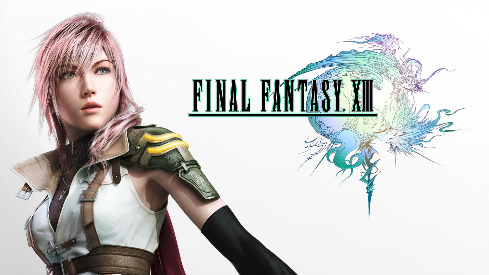
#### Comparison
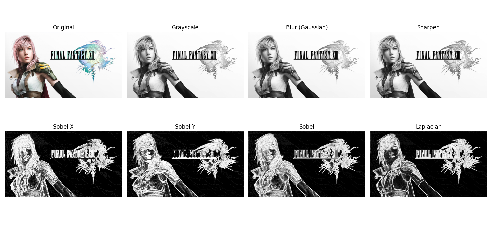
#### Grayscale

#### Grayscale Gaussian Blur

#### Sharpen
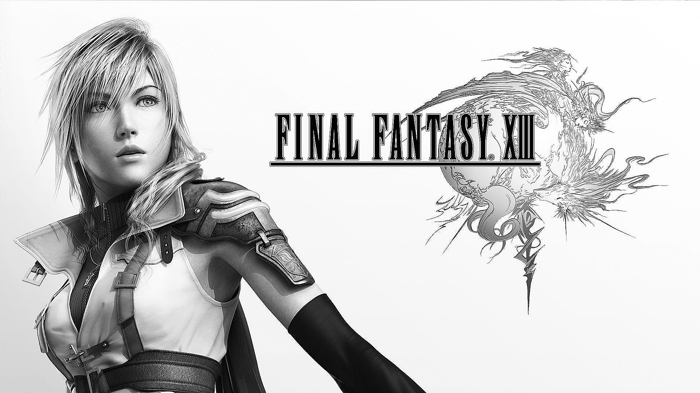
#### Sobel X Gradient
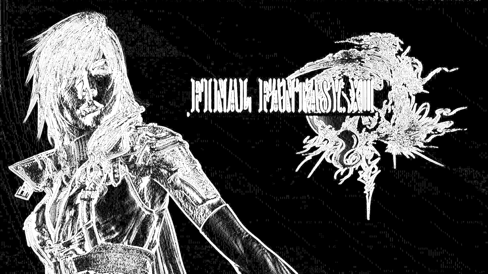
#### Sobel Y Gradient
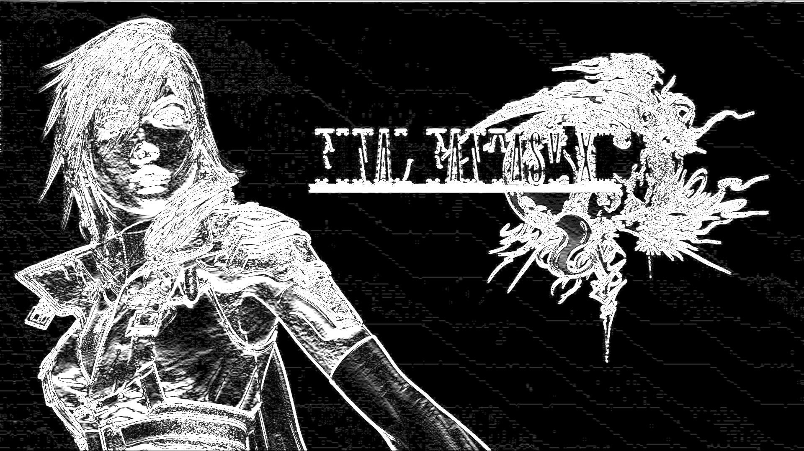
#### Sobel
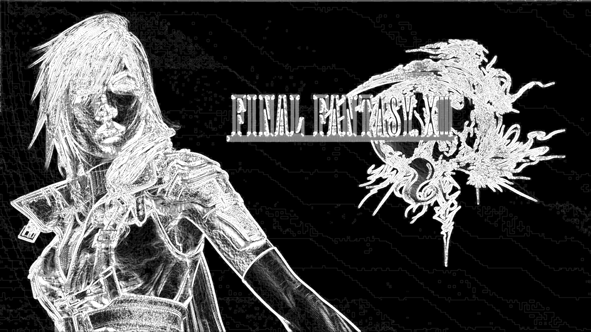
#### Laplacian
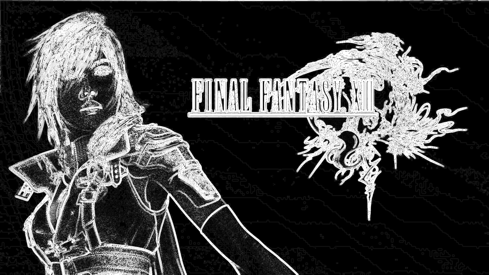


## 03 - Segmentando el Mundo (Binarización y Contornos)
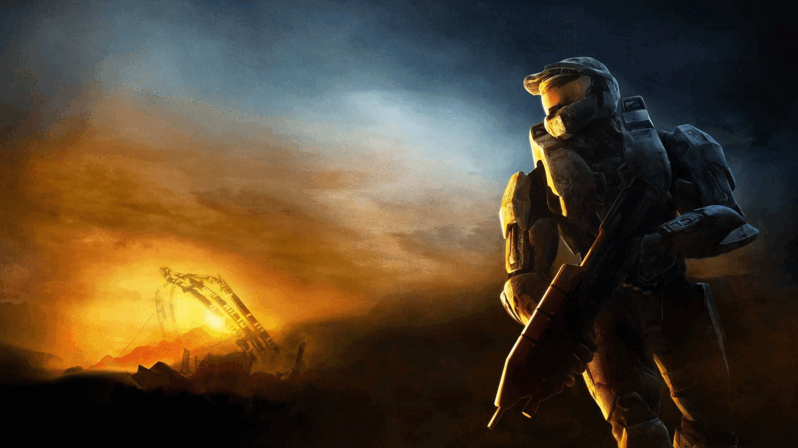
### Código Relevante
```python
#Grayscale conversion
img_gs = cv2.cvtColor(img, cv2.COLOR_BGR2GRAY)

#Gaussian Blur and GrayScale. Doesn't fuck up the colors. Used in the next processing steps. Noise Reduction.
img_gsblur = cv2.GaussianBlur(img_gs, (5, 5), 0)

#Edge Detection.

#Sobel X & Y gradients
img_grad_sobx = cv2.Sobel(img_gsblur, cv2.CV_64F, 1, 0, ksize = 5) 
img_grad_soby = cv2.Sobel(img_gsblur, cv2.CV_64F, 0, 1, ksize = 5) 

abs_sobx = cv2.convertScaleAbs(img_grad_sobx)
abs_soby = cv2.convertScaleAbs(img_grad_soby)

#SOBEL
img_sobel = cv2.addWeighted(abs_sobx, 0.5, abs_soby, 0.5, 0)

#BINARIZATION (OTSU). Aut threshold val.
_, th_otsu = cv2.threshold(img_sobel, 0, 255, cv2.THRESH_BINARY + cv2.THRESH_OTSU)

#OPTIMIZATION: MORPHOLOGICAL OPENING (Erosion followed by Dilation)
#Breaks small connections between foreground and background noise.
#Sierra 117 contours not connected to sky anymore.
ker = np.ones((3, 3), np.uint8) # Small kernel for subtle cleaning
th_otsucl = cv2.morphologyEx(th_otsu, cv2.MORPH_OPEN, ker, iterations = 1)

#CONTOURS
#contours, _ = cv2.findContours(th_otsu, cv2.RETR_EXTERNAL, cv2.CHAIN_APPROX_SIMPLE) No opt. applied.
contours, _ = cv2.findContours(th_otsucl, cv2.RETR_EXTERNAL, cv2.CHAIN_APPROX_SIMPLE)
```
### Resultados
#### Original Image

#### Contours
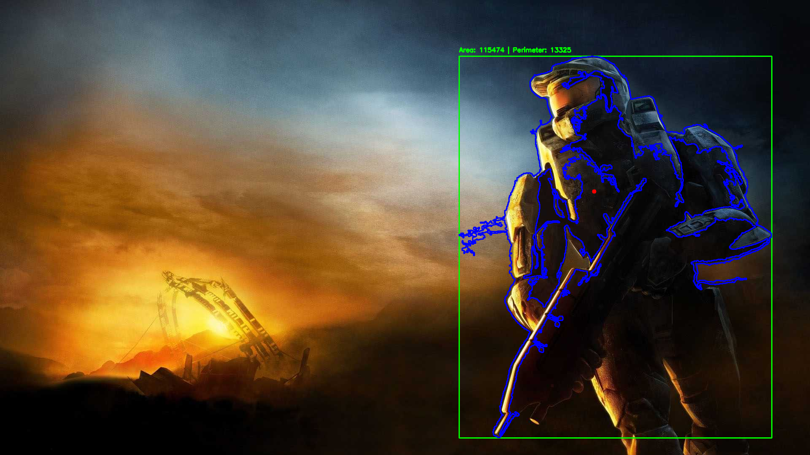

## 04 - Imágen = Matriz (Canales, Slicing, Histogramas)
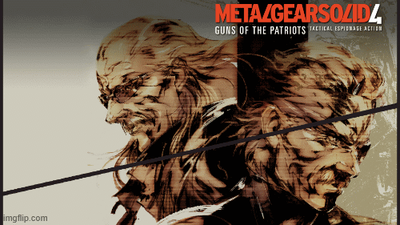
### Código Relevante
```python
#MOD 0. COLORS IN REGION
#RGB vals (bgr in cv2 for some reason)
b, g, r = cv2.split(img_mod0)

#HSV vals
img0_hsv = cv2.cvtColor(img_mod0, cv2.COLOR_BGR2HSV)
h, s, v = cv2.split(img0_hsv)

#Slicing, img -> 3D Numpy array (H, W, Color)
h, w, c = img_mod0.shape

# Slice a [h, w] target region. Centered rect at origin.
x0, x1 = w // 4, 3 * w // 4
y0, y1 = h // 4, 3 * h // 4

target = img_mod0[y0 : y1, x0 : x1]

#Mods. In place.
#Change Color
#Blue -> 75.
target[:, :, 0] = 191
#Green -> 50%
target[:, :, 1] = 127
#Red -> 25%
target[:, :, 2] = 63

```
### Resultados
#### Original Image

#### Origianl & Modified Image Comparison
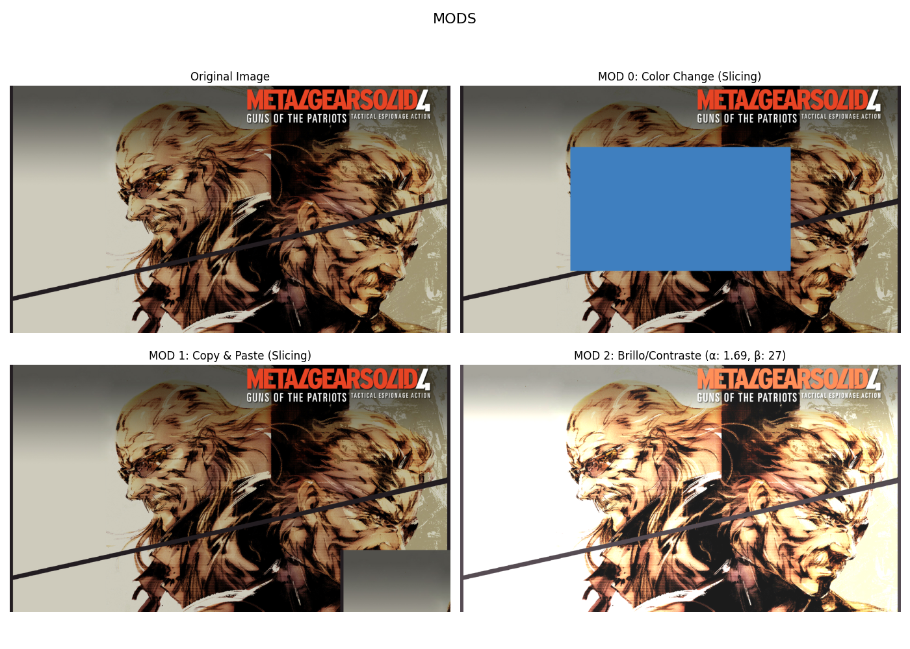
#### Original & Modified Image Histograms Comparison
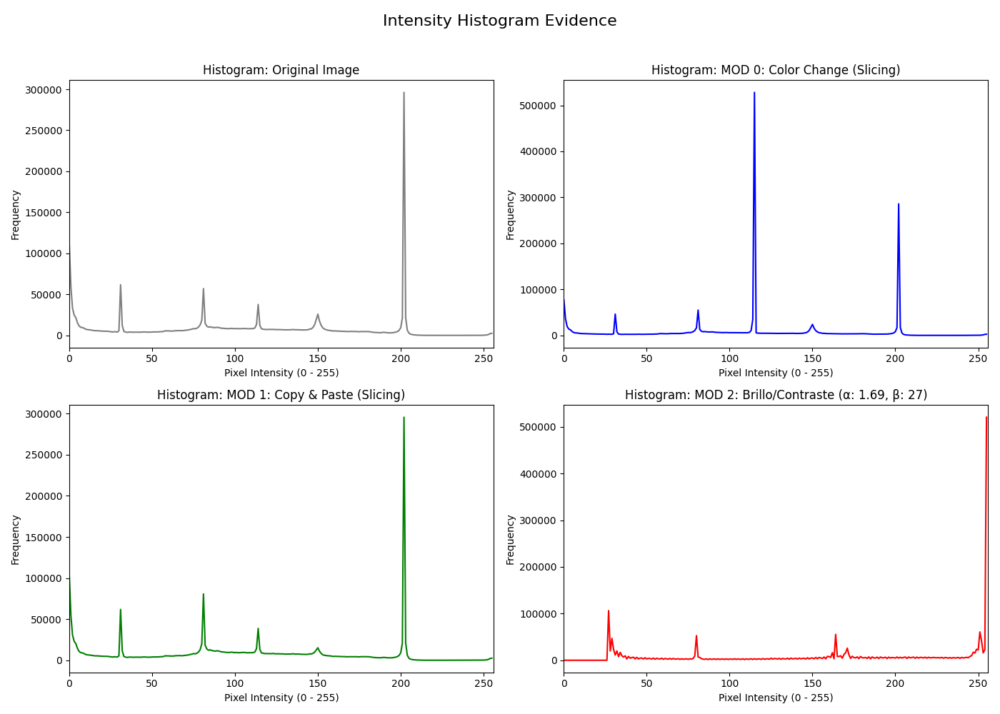

## 05 - Rasterización desde Cero (Línea, Círculo, Triángulo)

### Código Relevante
```python
#BRESENHAM'S LINE ALGORITHM

def lineHBresenham(x0, y0, x1, y1, draw):
    dx = x1 - x0
    dy = y1 - y0

    ydir = 1 if y1 > y0 else -1

    dy *= ydir

    y = y0
    D = 2 * dy - dx
 
    for x in range(x0, x1 + 1):
        if draw:
            canvas[y, x] = BLACK
        else:
            if y != y1:
                hlines[y].append(x)

        if D >= 0:
            y += ydir
            D -= 2 * dx
        D += 2 * dy


def lineVBresenham(x0, y0, x1, y1, draw):
    dx = x1 - x0
    dy = y1 - y0

    xdir = 1 if x1 > x0 else -1

    dx *= xdir

    x = x0
    D = 2 * dx - dy
    for y in range(y0, y1 + 1):
        if draw:
            canvas[y, x] = BLACK
        else:
            if y != y1:
                hlines[y].append(x)

        if D >= 0:
            x += xdir
            D -= 2 * dy
        D += 2 * dx

def lineBresenham(x0, y0, x1, y1, draw):
    dx = x1 - x0
    dy = y1 - y0
  
    if not draw and dy == 0:
        return
  
    if dx == 0 and dy == 0:
        #point
        if draw:
            canvas[y0, x0] = BLACK; 
            return
        else:
            hlines[y0].append(x0) 
    
    adx = abs(dx)
    ady = abs(dy)
  
  
    if adx > ady:
        if x1 > x0:
            lineHBresenham(x0, y0, x1, y1, draw)
        else:
            lineHBresenham(x1, y1, x0, y0, draw)
    else:
        if y1 > y0:
            lineVBresenham(x0, y0, x1, y1, draw)
        else: 
            lineVBresenham(x1, y1, x0, y0, draw)
```
### Resultados
#### Line
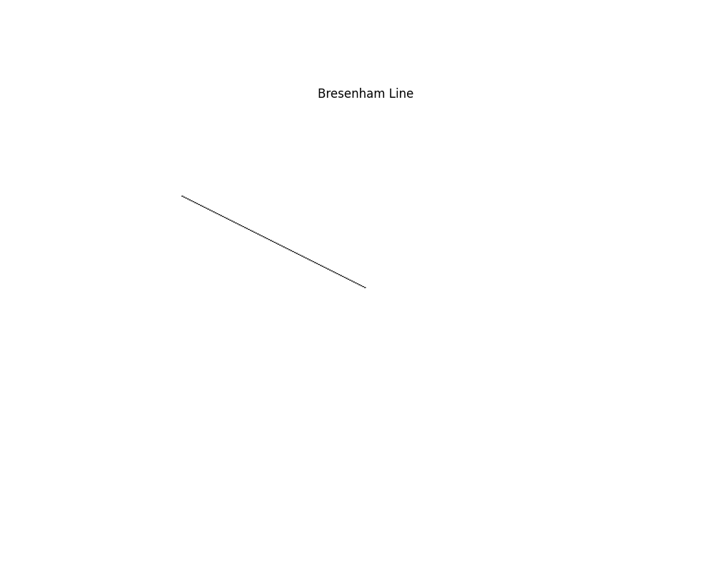
#### Triangle
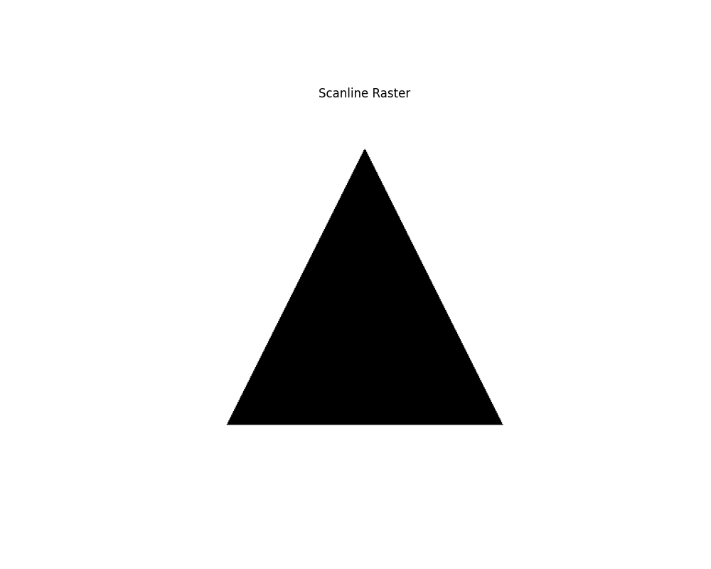
#### Circle
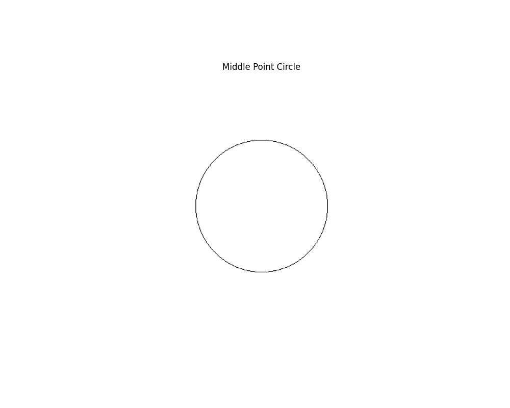

## Reflexión Final
Hecho.