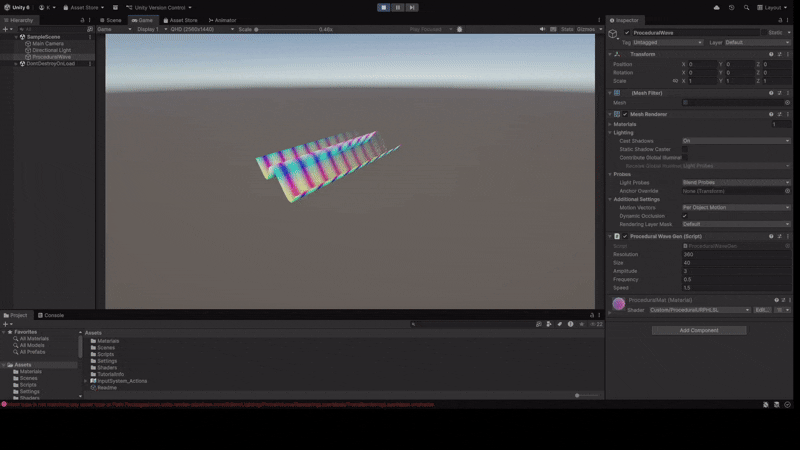
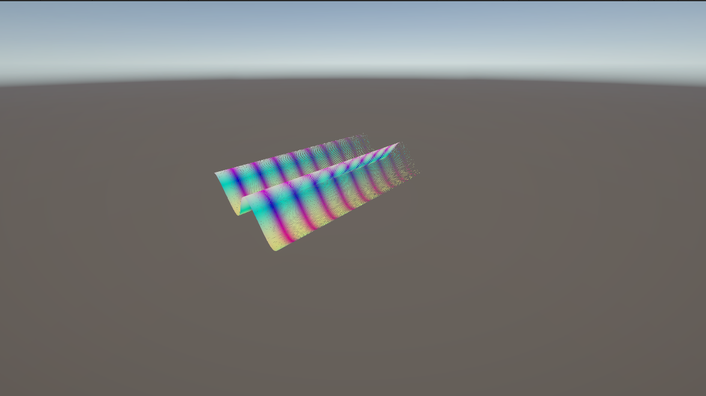

# Proyecto: Geometría Procedural, Shaders y Espacios Proyectivos
2025-11-07

## Estructura

```
2025-11-07_Taller_3_Integrado/
├── renders/                 #Generated GIFs & Images.
├── unity/
    ├── T3_Int_Sec_2_3_11/   #Folder with Unity Scene objects and structure
        ├── Assets/
           ├── Materials/    #Procedural Material.
           ├── Scripts/      #Game Object procedural behaviour gen & Camera Projection Switch. 
           ├── Shaders/      #HLSL Custom Procedural Shader.
├── README.md                #You are here man.            
```

#### Implementación: Brayan Rubiano
## IMPORTANTE: [Enlace repositorio Taller 3 en grupo completo](https://github.com/miamartinezfe/visual-computing-project/tree/main/2025-11-7_taller_3_integrado_computacion_visual)
      
Este documento describe la implementación de técnicas de gráficos por computadora en Unity (Universal Render Pipeline, URP), enfocándose en la generación de geometría dinámica y shaders procedurales.






---

## 1. Introducción

El objetivo de este proyecto es demostrar las capacidades de la **Generación Procedural en CPU** (C#) y el **Renderizado Procedural en GPU** (HLSL) para crear un efecto de onda dinámica y coloreada.

---

## 2. Secciones Implementadas

El proyecto aborda y completa las siguientes secciones del taller:

| Sección | Tema | Implementación |
| :--- | :--- | :--- |
| **Sección 2** | **Geometría Procedural (CPU)** | Generación de una malla de plano dinámica. Deformación en tiempo real de los vértices (altura **Y**) usando una función **senoidal 1D** (`ProceduralWaveGen.cs`). |
| **Sección 3 & 4** | **Shaders Procedurales (GPU)** | Implementación de un *shader* URP en **HLSL** (`ProceduralURPHLSL.shader`). El color se calcula en el *Fragment Shader* basándose en la **posición mundial** (`positionWS`) y el **tiempo** (`_Time.y`). |
| **Sección 11** | **Proyección de Cámara** | Control de la vista de la cámara, permitiendo el *toggle* entre proyecciones `Perspectiva` y `Ortografica` (Barra Espaciadora commo *Trigger*). |


## 3. Componentes Clave del Código

| Archivo | Objeto Asignado | Función Principal |
| :--- | :--- | :--- |
| **`ProceduralWaveGen.cs`** | `ProceduralWave` | Genera la malla (`Mesh`), almacena las posiciones base (`baseVertices`), y calcula la deformación de la onda en `Update()`. |
| **`ProceduralURPHLSL.shader`** | `ProceduralMat` | Contiene el código HLSL para calcular el color dinámico y el mapeo. |
| **`CameraSwitch.cs`** | `Main Camera` | Fija la posición de cámara inicial y gestiona el *toggle* de proyección al presionar la **Barra Espaciadora**. |

## 4. Código Relevante
#### `ProceduralWaveGen.cs`
```csharp
void CreateProceduralMesh()
{
    // Vertex and UV gen
    List<Vector3> vertices = new List<Vector3>();
    List<Vector2> uvs = new List<Vector2>();

    for (int i = 0; i <= resolution; i++)
    {
        for (int j = 0; j <= resolution; j++)
        {
            // Vertex pos. Center at (0, 0, 0)
            float x = (float)i / resolution * size - size / 2f;
            float z = (float)j / resolution * size - size / 2f;
            vertices.Add(new Vector3(x, 0, z));
            uvs.Add(new Vector2((float)i / resolution, (float)j / resolution));
        }
    }
    mesh.vertices = vertices.ToArray();
    mesh.uv = uvs.ToArray();

    // Triangle gen -> Quad gen.
    List<int> triangles = new List<int>();
    for (int i = 0; i < resolution; i++)
    {
        for (int j = 0; j < resolution; j++)
        {
            int a = i * (resolution + 1) + j;
            int b = a + 1;
            int c = (i + 1) * (resolution + 1) + j;
            int d = c + 1;

            // Quad triangulation
            triangles.Add(a); triangles.Add(c); triangles.Add(b);
            triangles.Add(b); triangles.Add(c); triangles.Add(d);
        }
    }
    mesh.triangles = triangles.ToArray();
    mesh.RecalculateNormals();
}

void Update()
{
    if (baseVertices == null || baseVertices.Length == 0) return;

    currentVertices = mesh.vertices;

    for (int i = 0; i < currentVertices.Length; i++)
    {
        Vector3 basePos = baseVertices[i];

        // Wave behaviour. (Sine function used)
        float waveY = amplitude * Mathf.Sin(
            (basePos.x * frequency) + (Time.time * speed)
        );

        // New Height recalc.
        currentVertices[i] = new Vector3(basePos.x, waveY, basePos.z);
    }

    mesh.vertices = currentVertices;
    mesh.RecalculateNormals();
    mesh.RecalculateBounds();

}
```

#### `ProceduralURPHLSL.shader`
``` csharp 
HLSLPROGRAM

#pragma vertex vert
#pragma fragment frag

#include "Packages/com.unity.render-pipelines.universal/ShaderLibrary/Core.hlsl"

struct Attributes {
    float4 positionOS : POSITION; 
};

struct Varyings {
    float4 positionCS : SV_POSITION; 
    float3 positionWS : TEXCOORD0; // Vertex pos in World Space
};

CBUFFER_START(UnityPerMaterial)
    float4 _Color;
    float _Frequency;
    float _Speed;
CBUFFER_END

// Vertex Shader
Varyings vert (Attributes input) {
    Varyings output;
    output.positionCS = TransformObjectToHClip(input.positionOS.xyz);
    output.positionWS = TransformObjectToWorld(input.positionOS.xyz);

    return output;
}

// Fragment Shader (Procedural Color Calc.)
float4 frag (Varyings input) : SV_Target {
    
    float time = _Time.y; 

    // Color given time and pos.
    float r_comp = sin(input.positionWS.x * _Frequency + time * _Speed);
    float g_comp = sin(input.positionWS.z * _Frequency * 1.5 + time * _Speed * 1.5);
    
    // Mapping. Normalization from [-1, 1] -> [0, 1] coords..
    float intensityR = r_comp * 0.5 + 0.5;
    float intensityG = g_comp * 0.5 + 0.5;
    float intensityB = input.positionWS.y * 0.1 + 0.5; // BLUE -. Height
    
    float4 proceduralColor = float4(intensityR, intensityG, intensityB, 1.0);
    
    // Mix Procedural Color and Base Color
    return proceduralColor * _Color;
}
ENDHLSL
```

#### `CameraSwitch.cs`
``` csharp 
private Camera mainCamera;
void Start()
{
    mainCamera = GetComponent<Camera>();
    mainCamera.orthographic = false; // DEFAULT = PERSPECTIVE

    // Initial Camera pos.
    transform.position = new Vector3(25, 20, -30);
    transform.rotation = Quaternion.Euler(30, -45, 0);

    mainCamera.fieldOfView = 80;
}


void Update()
{
    // Camera Switch trigger = SpaceBar.
    if (Input.GetKeyDown(KeyCode.Space))
    {
        // Switch Projection
        mainCamera.orthographic = !mainCamera.orthographic;

        if (mainCamera.orthographic)
        {
            // Ortho adjustment. Size.
            mainCamera.orthographicSize = 18;
            Debug.Log("ORTHOGRAPHIC: (Sec. 11).");
        }
        else
        {
            Debug.Log("PERSPECTIVE:(Sec. 11).");
        }
    }
}
```