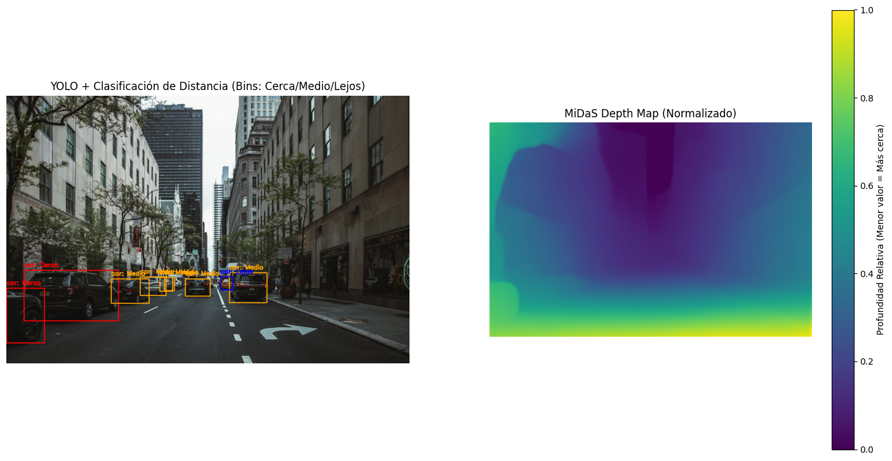
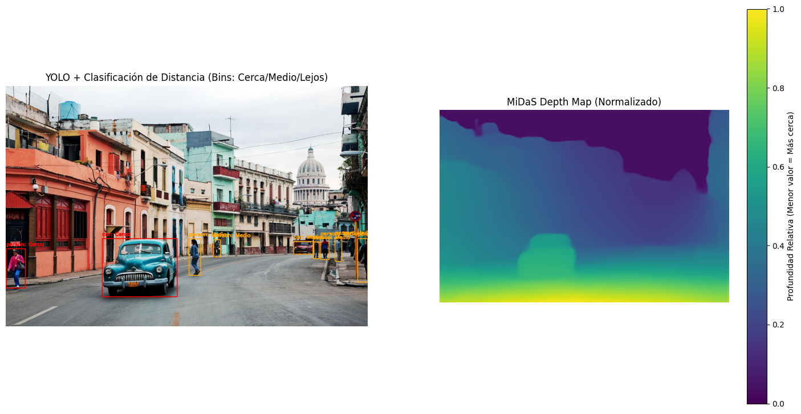
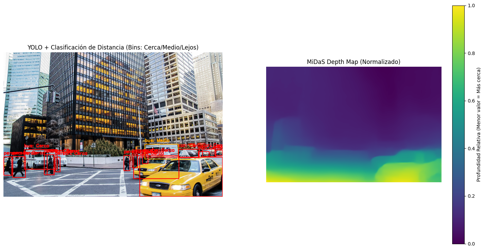
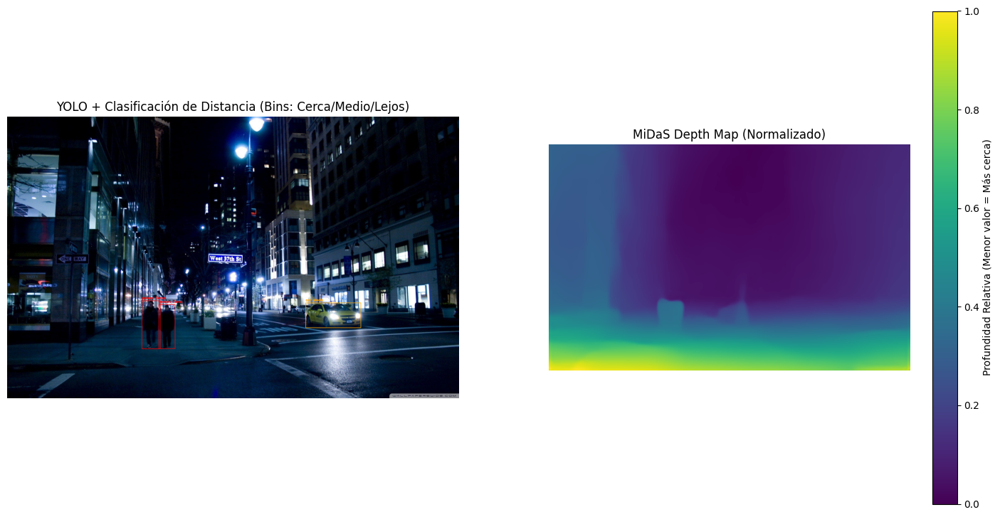
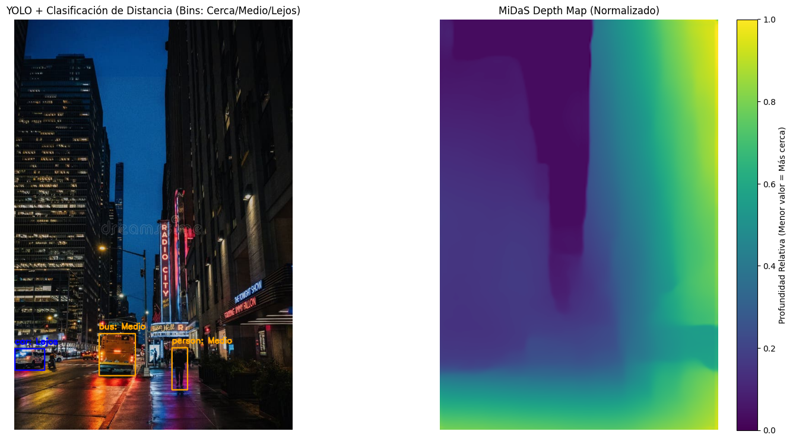

# MiDaS
2025 - 11 - 08

### IMPORTANTE: [Enlace Repositorio Práctica Grupal Completa](https://github.com/miamartinezfe/visual-computing-project/tree/main/2025-11-08-practica_percepcion_multimodelo)  
**Entrar al enlace de colab con el correo institucional (@unal.edu,co).**

## Resumen
**Concepto Artístico**: **Urbano** 

### YOLO (Detección Base)

Se utilizó el modelo YOLOv8n para la detección inicial debido a su optimización en velocidad. Su tarea es localizar y etiquetar los objetos clave del entorno urbano (`car`, `person`, `bus`, `traffic light`) para generar las Bounding Boxes (BBoxes), que sirven como las regiones de interés (ROI) para el análisis de profundidad.

### MiDaS (Generación y Análisis del Mapa de Profundidad)

Generación del Mapa

Se empleó el modelo `MiDaS_small` (PyTorch Hub) que es un modelo de estimación de profundidad monocular. Este modelo procesa la imagen RGB y genera un Mapa de Profundidad Relativa para cada píxel. MiDaS no produce distancias métricas (metros), sino la disparidad o profundidad relativa.

**Interpretación**: Los valores bajos en el mapa MiDaS generalmente indican cercanía (alta disparidad), y los valores altos indican lejanía.

Para traducir la profundidad relativa a una métrica accionable, se siguió este proceso:

- Cálculo de Referencia: Se calculó la mediana de profundidad de toda la escena (`scene_depth_median`). Esta mediana actúa como el "punto medio" dinámico de la escena.

- Métrica de Objeto: Para cada BBox de YOLO, se extrajeron los valores del mapa de profundidad MiDaS y se calculó la mediana de esos valores (`avg_object_depth`). Este método es más robusto a los valores atípicos que el promedio simple.

- Clasificación en Bins: Se definieron tres bins de distancia (`Cerca`, `Medio`, `Lejos`) usando umbrales porcentuales de la mediana de la escena (ej., 0.6 y 1.4).

- Ajuste de la Lógica: Debido a la contaminación del BBox (la caja incluye mucho fondo lejano, elevando el valor de la mediana del objeto) o a una salida inesperada del modelo, se aplicó una inversión forzada de etiquetas. Esto aseguró que los objetos con valores de profundidad altos (contaminados, pero físicamente cercanos) se etiquetaran como "Cerca", y viceversa.

## Resultados
### Escena 1

### Escena 2

### Escena 3

### Escena 4

### Escena 5

## Limitaciones y Retos Enfrentados

- Contaminación del Bounding Box (BBox): El desafío más crítico. El BBox de YOLO, al ser rectangular, incluye píxeles del fondo lejano en la región de objetos cercanos (e.g., asfalto detrás de un coche). Estos valores altos sesgan la mediana de profundidad del objeto hacia "Lejos", haciendo incorrecta la clasificación sin una inversión manual de la lógica o sin el uso de segmentación.

- Naturaleza Relativa de MiDaS: La salida es solo relativa (disparidad). La clasificación Cerca/Medio/Lejos es válida solo en el contexto de la escena actual y no se traduce directamente a distancias en metros.