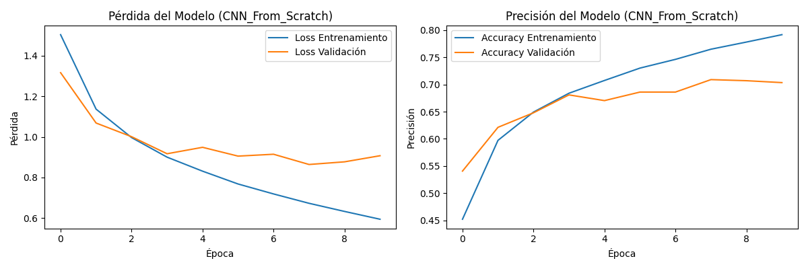
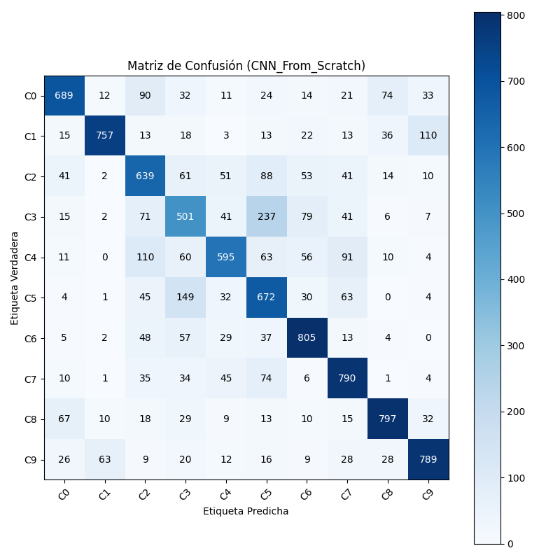
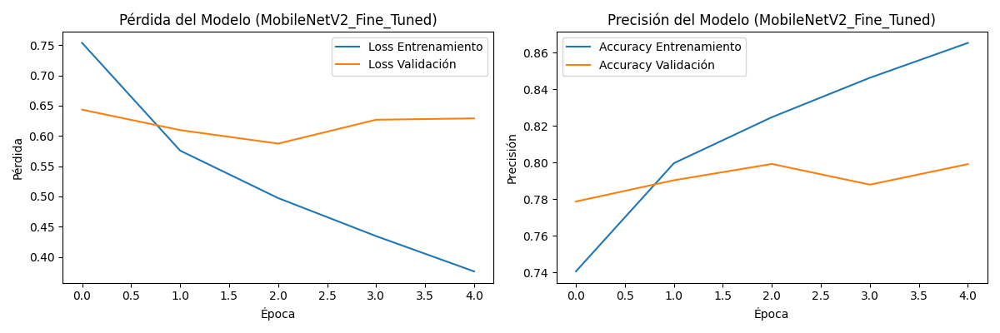
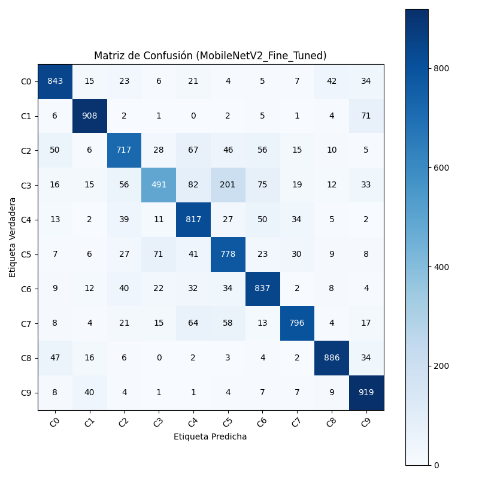

# Taller 4 Integral: Computación Visual Avanzada
2025-12-04
## Deep Learning. Entrenamiento de Modelo desde Cero y Fine-Tuned (MobileNetV2)

## Estructura

```
2025-11-07_Taller_4_Computacion_Visual_Avanzada/
├── python/
    ├──src/
        ├──CNN_brubianop.ipynb  #Jupyter Notebook Implementation
├── results/                    #.png, .json and .h5 data for comparisons, raw data, and models.
├── README.md                   #You are here man.            
```

#### Implementación: Brayan Rubiano

## IMPORANTE: [Enlace Repositorio Taller Grupal Completo:](https://github.com/miamartinezfe/visual-computing-project/tree/main/2025-12-02_taller_4) 

**Implementación Subsistema 5**: Entrenamiento y Comparación de Modelos (`CNN` + `Fine-Tuning`). El objetivo principal es demostrar la eficacia del Transfer Learning mediante la comparación rigurosa de dos enfoques de entrenamiento distintos para una tarea de `clasificación de imágenes`.

Se presenta un módulo funcional y autocontenido que produce modelos entrenados, métricas de rendimiento y evidencias visuales.

## Metodología de Comparación

Se emplearon dos modelos para la misma tarea de clasificación, utilizando el dataset `CIFAR-10` (clasificación de 10 clases de objetos):

### 1. Modelo 1: CNN Entrenada Desde Cero

**Descripción**: Diseño y entrenamiento de una Red Neuronal Convolucional (CNN) con una arquitectura simple (varias capas `Conv2D` y `MaxPooling2D`) desde pesos iniciales aleatorios.

**Objetivo**: Servir como la línea base de rendimiento para la comparación.

### 2. Modelo 2: Fine-Tuning (Transfer Learning)

**Descripción**: Uso de la arquitectura `MobileNetV2`, pre-entrenada en el masivo dataset ImageNet. Se congelaron los pesos de las capas convolucionales (extracción de características) y se re-entrenaron únicamente las capas clasificadoras superiores.

**Objetivo**: Demostrar cómo el conocimiento previamente adquirido por el modelo pre-entrenado resulta en una mayor precisión y una convergencia más rápida.

## Instrucciones de Ejecución

Abrir la notebook principal.

Asegurarse de que el directorio `results/` exista.

Ejecutar secuencialmente las celdas las cuales tienen como finalidad:

- Importar `Dependencias`.

- Cargar y preprocesar el dataset `CIFAR-10`.

- Entrenar el Modelo 1 (`CNN_Scratch`).

- Entrenar el Modelo 2 (`MobileNetV2_Finetuned`).

La ejecución generará y guardará automáticamente los modelos (.h5), las gráficas (.png) y los reportes de métricas (.json) en la carpeta `results/` en el entorno de Notebook.

## Resultados

### Modelo I: CNN Desde Cero

#### History Plot


#### Confusion Matrix


### Modelo II: Fine-Tuning (MobileNetV2)



#### Confusion Matrix


### Comparación

**Métricas**

- Modelo 1: CNN Desde Cero
Métricas detalladas para CNN_From_Scratch guardadas en `results/metrics_CNN_From_Scratch.json`.

| Cat. | precision |  recall | f1-score | support |
|:----:|:---------:|:--------:|:-------:|:-------:|
|  C0  |   0.78    |   0.69   |  0.73   |   1000
|  C1  |   0.89    |   0.76   |  0.82   |   1000
|  C2  |   0.59    |   0.64   |  0.62   |   1000
|  C3  |   0.52    |   0.50   |  0.51   |   1000 
|  C4  |   0.72    |   0.59   |  0.65   |   1000
|  C5  |   0.54    |   0.67   |  0.60   |   1000
|  C6  |   0.74    |   0.81   |  0.77   |   1000
|  C7  |   0.71    |   0.79   |  0.75   |   1000
|  C8  |   0.82    |   0.80   |  0.81   |   1000
|  C9  |   0.79    |   0.79   |  0.79   |   1000

    accuracy                            0.70     10000
    macro avg       0.71      0.70      0.70     10000
    weighted avg    0.71      0.70      0.70     10000

- Modelo 2: MobileNetV2 Fine-Tuning
Métricas detalladas para ModileNetV2_Fine_Tunes guardadas en `results/metrics_MobileNetV2_Fine_Tuned.json`.

| Cat. | precision |  recall | f1-score | support |
|:----:|:---------:|:--------:|:-------:|:-------:|
|  C0  |   0.84    |   0.84   |  0.84   |  1000
|  C1  |   0.89    |   0.91   |  0.90   |  1000
|  C2  |   0.77    |   0.72   |  0.74   |  1000
|  C3  |   0.76    |   0.49   |  0.60   |  1000
|  C4  |   0.72    |   0.82   |  0.77   |  1000
|  C5  |   0.67    |   0.78   |  0.72   |  1000
|  C6  |   0.78    |   0.84   |  0.81   |  1000
|  C7  |   0.87    |   0.80   |  0.83   |  1000
|  C8  |   0.90    |   0.89   |  0.89   |  1000
|  C9  |   0.82    |   0.92   |  0.86   |   1000

    accuracy                            0.80     10000
    macro avg       0.80      0.80      0.80     10000
    weighted avg    0.80      0.80      0.80     10000


### Rendimiento Global de Modelos

| Métrica | CNN Desde Cero | Fine-Tuning (MobileNetV2) |
|:--------|---------------:|--------------------------:|
| **Accuracy** | 0.70 | 0.80 |
| **F1-Score (W.)** | 0.70 | 0.80 |
| **Tiempo (Épocas)** | 10 | 5 |


**Curvas de Entrenamiento**

Las gráficas de historial de pérdida y precisión muestran la evolución del aprendizaje.


- Modelo 1: CNN Desde Cero

Observación: La curva de Validación Loss es volátil y la brecha entre la Accuracy de Entrenamiento y Validación sugiere un sobreajuste (overfitting) después de la quinta época.

- Modelo 2: Fine-Tuning (MobileNetV2)

Observación: La Validación Loss es baja y las curvas de Accuracy son estables y altas desde el inicio, demostrando que el modelo convergió rápidamente y se ajustó bien a los datos de prueba.

**Matriz de Confusión (Evaluación de Errores)**

La Matriz de Confusión permite visualizar qué clases son predichas correctamente y dónde se cometen los errores.

- Matriz de Confusión: CNN Desde Cero

Análisis: La matriz muestra una dispersión de predicciones incorrectas (valores fuera de la diagonal principal), indicando que el modelo tiene dificultades para distinguir consistentemente entre las 10 clases.

- Matriz de Confusión: Fine-Tuning (MobileNetV2)

Análisis: Los valores altos están fuertemente concentrados en la diagonal principal, lo que indica un número mucho mayor de predicciones correctas y una alta fiabilidad del clasificador.