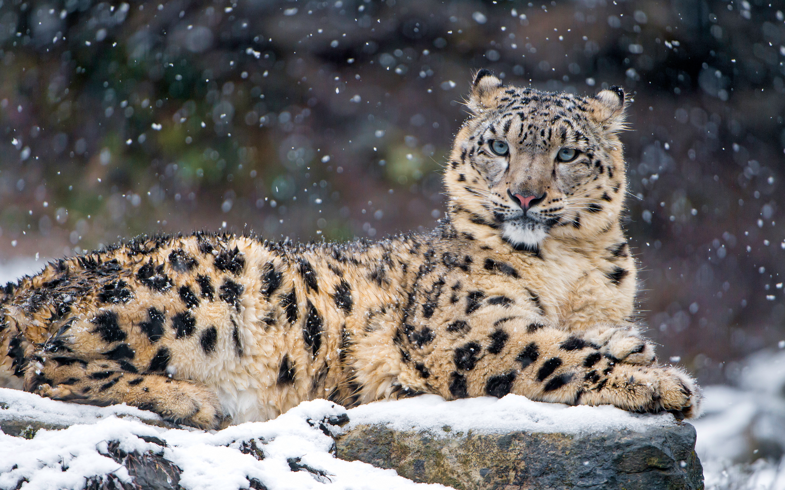
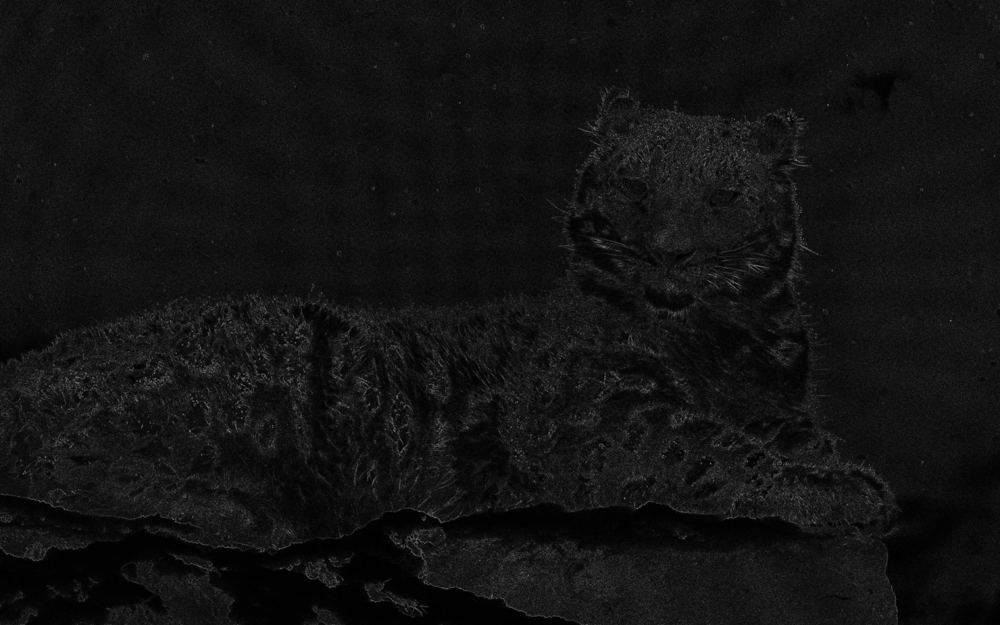
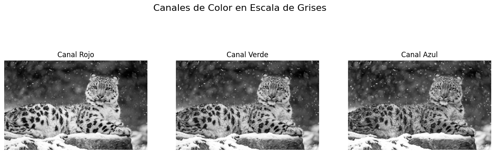
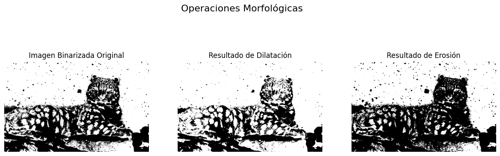
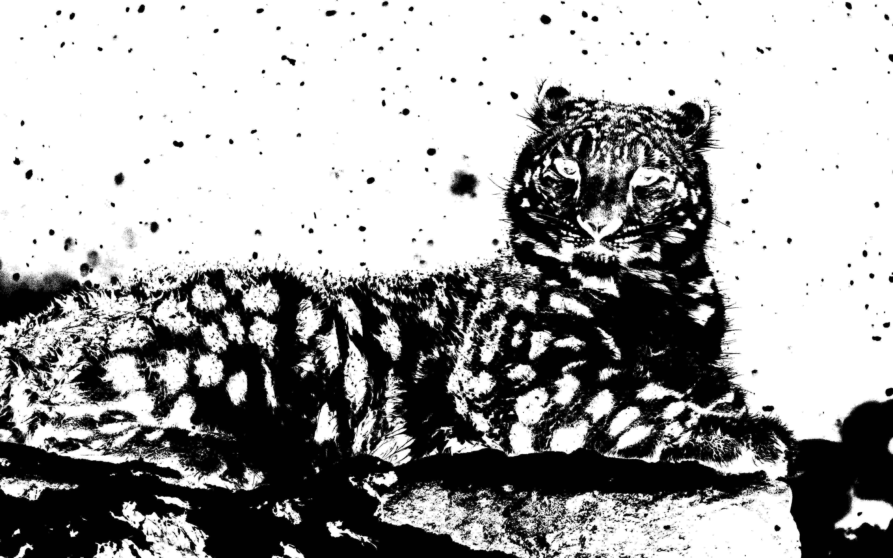
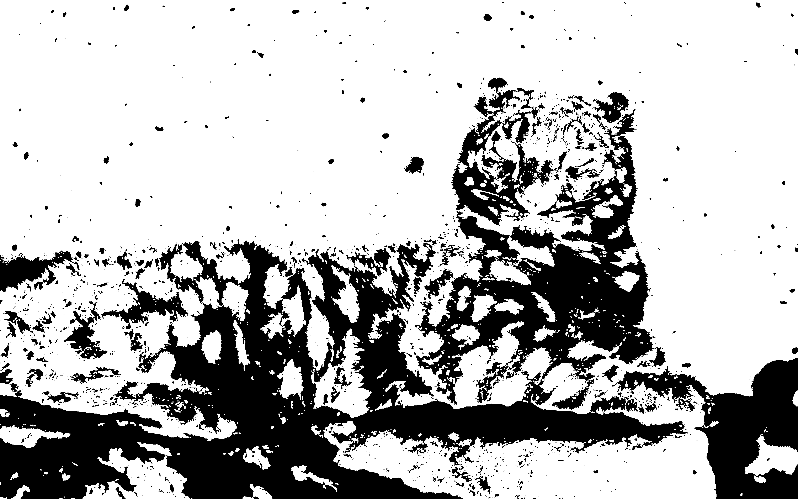
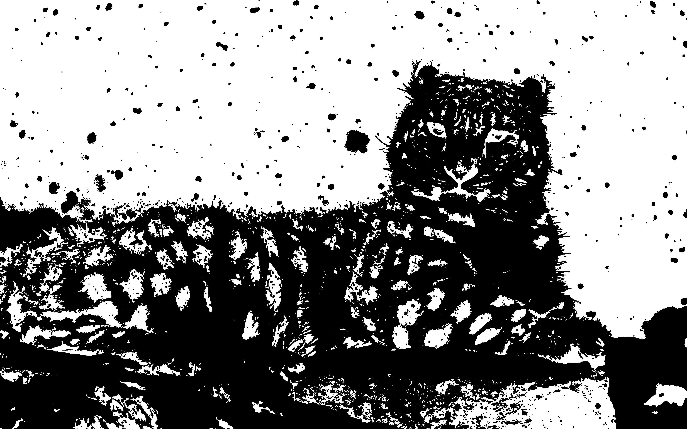

# Examen Final Computación Visual
2025-12-06

#### Nombre: Brayan Rubiano
#### Email Institucional: brubianop@unal.edu.co

## Punto 1 – Python

El objetivo de este punto fue demostrar habilidades básicas de **Procesamiento Digital de Imágenes (PDI)** utilizando la librería `OpenCV` en Python, enfocándonos en una imagen a color de un animal en vía de extinción.

### Análisis y Transformación

El proceso inició cargando la imagen RGB, la cual fue sometida a diferentes transformaciones. Inicalmente se aplicaron una serie de **Filtros Básicos**, estos son  un **Filtro Gaussiano** para el suavizado, lo que eliminó el ruido y desenfocó ligeramente los detalles al promediar los píxeles vecinos. Seguidamente, se aplicó un **Filtro Laplaciano** que logró el efecto opuesto: realzó los bordes, dejando visible solo los contornos y las líneas de alto contraste. 

Luego, al separar los **Canales RGB**, se observó cómo la intensidad de la luz roja, verde o azul afecta las estructuras. Por ejemplo, la vegetación se vuelve muy brillante en el canal Verde, mientras que el pelaje rojizo destaca en el canal Rojo.

### Morfología y Animación

Para las **Operaciones Morfológicas**, la imagen se binarizó previamente para aislar el objeto. Aplicando incialmente **Dilatación**, el resultado obtenido expandió los límites de los objetos de primer plano (haciéndolos "engordar"), lo cual es útil para rellenar pequeños agujeros. La operación de **Erosión** encogió los objetos y eliminó el ruido fino. Finalmente, se generó un **GIF** que secuencia la imagen original, los resultados de los filtros de suavizado y detección de bordes, y las operaciones morfológicas, proporcionando una visión dinámica del efecto de cada técnica de procesamiento.

### Resultados
### Imágenes

#### Original (Snow Leopard)

#### Suavizado (Gauss)

#### Bordes (Laplace)

#### Canales de Color

#### Operaciones Morfológicas

#### Binarización

#### Dilatación

#### Erosión

### GIF
#### Secuencia de filtros aplicados.

